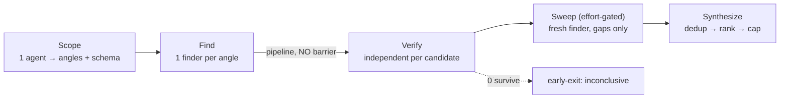

# Dynamic Workflow Design Patterns (discovered from the bundled workflows)

> Reverse-engineered from the two **production** workflow scripts shipped in Claude Code v2.1.193 — `code-review` and `deep-research`. These are the patterns Anthropic actually ships, not generic advice. Code is reconstructed/condensed from the bundle; names match the originals where readable.

Both scripts share one backbone — **Scope → fan-out Find → stream Verify → Synthesize** — and differ mainly in the verify strategy (single independent verifier vs N-vote quorum). The shape generalizes to: **fan out → verify independently → reduce/synthesize.**



---

## Pattern 1 — Scope first, with a schema

A single lead agent pins the context and emits a **structured plan** (angles to pursue, the diff command, conventions) that the rest of the run consumes. Everything downstream keys off this object.

```js
phase("Scope")
const scope = await agent(SCOPE_PROMPT, { label: "scope", schema: SCOPE_SCHEMA })
// scope.angles drives the finder fan-out; scope also carries diff cmd, files, conventions
```

Why: one cheap agent turns a vague task into a typed work-list the script can iterate deterministically.

---

## Pattern 2 — Stream find → verify with `pipeline` (no barrier)

Finders fan out, and **each finder's candidates are verified the moment that finder returns** — not after all finders finish. This is the canonical use of `pipeline()` (the second stage is itself a `parallel` over that finder's candidates).

```js
const FINDERS = CORRECTNESS_ANGLES.slice(0, P.correctnessAngles).map(a => ({ ...a, kind: "correctness" }))
  .concat(CLEANUP_ANGLES.map(a => ({ ...a, kind: "cleanup" })))

const finderResults = await pipeline(
  FINDERS,
  f => agent(FINDER_PROMPT(f), { label: f.label, phase: "Find", schema: CANDIDATES_SCHEMA })
        .then(r => ({ finder: f, candidates: (r?.candidates ?? []).slice(0, P.perAngle) })),
  result => parallel(result.candidates.map(c => () => verifyCandidate({ ...c, kind: result.finder.kind })))
)
let verified = finderResults.flat().filter(Boolean)
```

Why: a slow finder never blocks a fast finder's verification. Wall-clock = slowest single finder→verify chain.

---

## Pattern 3 — One independent verifier per candidate (adversarial, structured verdict)

Every candidate gets its **own** verifier agent with a **verdict ladder** and a requirement to cite evidence. The original code-review comment is explicit:

> *No pre-verify dedup — every candidate gets a verifier; dedup happens once at synthesis.*

```js
function verifyCandidate(c) {
  return agent(VERIFIER_PROMPT(c), { label: "verify:" + base(c.file), phase: "Verify", schema: VERDICT_SCHEMA })
    .then(v => v ? { ...c, verdict: v.verdict, evidence: v.evidence } : null)  // null = skip/error
}
// verdict ∈ { CONFIRMED, PLAUSIBLE, REFUTED }; evidence must quote the relevant line(s)
const surviving = verified.filter(c => c.verdict !== "REFUTED")
```

Why: independent adjudication kills plausible-but-wrong findings; structured verdicts make the reduce step mechanical.

---

## Pattern 4 — N-vote adversarial quorum (deep-research)

For claims with no ground truth, run **N skeptical voters per claim**, each told to *refute*. A claim survives only if it was **actually adjudicated** (quorum of valid votes) **and** under the refutation threshold. Abstentions (null votes) must not count as a pass.

```js
const VOTES_PER_CLAIM = 3
const REFUTATIONS_REQUIRED = 2          // ≥2 of 3 refutations kill it

const voted = (await parallel(rankedClaims.map(claim => () =>
  parallel(Array.from({ length: VOTES_PER_CLAIM }, (_, v) => () =>
    agent(VERIFY_PROMPT(claim, v), { label: "v"+v, phase: "Verify", schema: VERDICT_SCHEMA })
  )).then(verdicts => {
    const valid    = verdicts.filter(Boolean)             // a vote can be null → abstain
    const refuted  = valid.filter(v => v.refuted).length
    const survives = valid.length >= REFUTATIONS_REQUIRED && refuted < REFUTATIONS_REQUIRED
    return { ...claim, survives }
  })
))).filter(Boolean)
const confirmed = voted.filter(c => c.survives)
```

The shipped comment nails the failure mode it guards:

> *Too many abstentions = unverified, which must NOT pass into the report (otherwise all-abstain → refuted=0 → false survive).*

Why: majority-refute voting is more robust than a single verifier when the claim can be wrong in subtle ways; the quorum guard prevents silent passes.

---

## Pattern 5 — Dedup once, at synthesis (never before verify)

Neither script dedups before verifying. Duplicates are merged **only** in the final synthesis agent, which also ranks and caps.

```js
// SYNTHESIS_SCHEMA carries a "duplicate_of" field: [i] labels folded into one finding
phase("Synthesize")
const report = await agent(SYNTHESIS_PROMPT(surviving), { label: "synthesize", schema: REPORT_SCHEMA })
// "Keep at most P.maxFindings decisions" — the model merges semantic dups, you cap the list
for (let i = 0; i < ranked.length && findings.length < P.maxFindings; i++) { /* ... */ }
```

Why: deduping early can drop a real finding that merely *looked* like another. Verify everything independently; collapse at the end.

---

## Pattern 6 — Completeness sweep, effort-gated

At high effort only, a **fresh finder** is handed the already-found list and told to hunt **only gaps** — and to return empty rather than pad.

```js
if (P.sweep) {
  phase("Sweep")
  const known = verified.map(c => "- " + c.file + ":" + c.line + " — " + c.summary).join("\n")
  const sweep = await agent(
    SCOPE_BLOCK + "\nAlready-found (do NOT re-derive):\n" + known +
    "\nLook ONLY for defects not listed. Focus on what the first pass misses: " + SWEEP_GAP_FOCUS +
    "\nUp to " + SWEEP_MAX + " more. If nothing new, return an empty list — do not pad.",
    { label: "sweep", phase: "Sweep", schema: CANDIDATES_SCHEMA })
  if (sweep?.candidates.length)
    verified = verified.concat((await parallel(sweep.candidates.slice(0, SWEEP_MAX)
      .map(c => () => verifyCandidate({ ...c, kind: "correctness" })))).filter(Boolean))
}
```

Why: the first pass has blind spots; a gap-only finder with the known list catches the tail without re-confirming what's done.

---

## Pattern 7 — Early-exit on empty

If verification kills everything, return an explicit "inconclusive / no findings" result **with stats** instead of synthesizing nothing.

```js
if (confirmed.length === 0) {
  return { question: QUESTION, summary: "All claims refuted by adversarial verification…",
           findings: [], refuted: killed.map(...), stats: { ...counts, confirmed: 0 } }
}
```

Why: a empty synthesis is wasted tokens and a confusing report; surface the negative result honestly.

---

## Pattern 8 — Effort-scaled fan-out (the parameter table)

Both scripts read a **config keyed by effort level** and scale breadth, not just the per-agent reasoning. From `code-review`:

```js
const PARAMS = {
  high:  { correctnessAngles: 3, perAngle: 6, maxFindings: 10, sweep: false },  // precision, 1-vote verify
  xhigh: { correctnessAngles: 5, perAngle: 8, maxFindings: 15, sweep: true  },  // recall
  max:   { correctnessAngles: 5, perAngle: 8, maxFindings: 15, sweep: true  },  // same fan-out as xhigh…
}
const SWEEP_MAX = 8
// shipped comment: "max → same structure as xhigh (the API reasoning effort differs, not the fan-out)"
```

Key insight: **`max` vs `xhigh` changes the per-agent reasoning effort, not the number of agents.** Breadth is tuned by the table; depth by `effort`. `high` is precision-biased (fewer angles, no sweep, 1-vote); `xhigh`/`max` are recall-biased (more angles, sweep on).

---

## Pattern 9 — Cost accounting

The script computes its own expected agent count for the stats block:

```js
agentCalls: 1 /*scope*/ + scope.angles.length + allSources.length
          + voted.length * VOTES_PER_CLAIM + 1 /*synthesize*/
```

Why: transparent cost, and a sanity check against the 1000-agent cap.

---

## The two shapes side by side

| Stage | `code-review` | `deep-research` |
|-------|---------------|-----------------|
| Scope | diff cmd, files, conventions, angles | research angles + sub-questions |
| Find | finder per correctness + cleanup angle | search per angle (WebSearch) |
| (extract) | — | WebFetch → claims + source quality |
| Verify | 1 independent verifier/candidate, verdict ladder | **3-vote** adversarial quorum/claim |
| Sweep | gap-only finder (xhigh/max) | — |
| Synthesize | merge dups, rank, cap `maxFindings` | cited report, dedup, cap |
| Early-exit | — | if 0 claims survive |
| Scaling | `PARAMS[effort]` table | `VOTES_PER_CLAIM`, angle count |

---

## Takeaways for writing your own

1. **Scope agent first**, emit a typed work-list.
2. **`pipeline` find→verify** so verification streams; reserve `parallel` barriers for genuine cross-item reductions.
3. **One independent (adversarial) verifier per item**, structured verdict, evidence required.
4. **Vote when there's no ground truth**; require a quorum and treat abstentions as non-passing.
5. **Dedup only at synthesis.** Verify everything; collapse at the end.
6. **Add a gap-only sweep** at high effort; tell it to return empty rather than pad.
7. **Early-exit** on empty.
8. **Scale breadth with an effort table; scale depth with `effort`.** They are orthogonal knobs.
9. **Cap and rank** the output; compute expected agent count.
