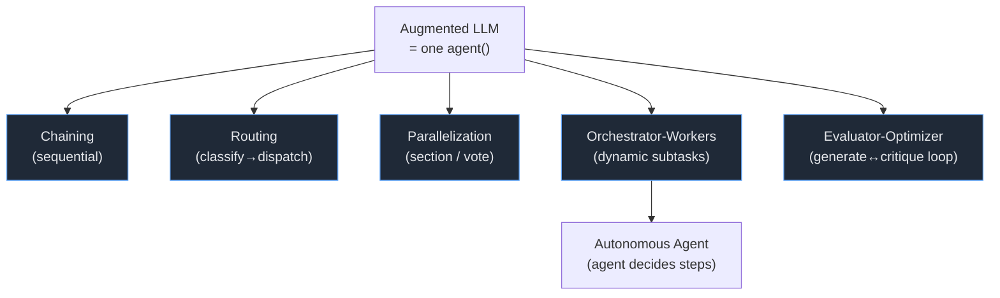
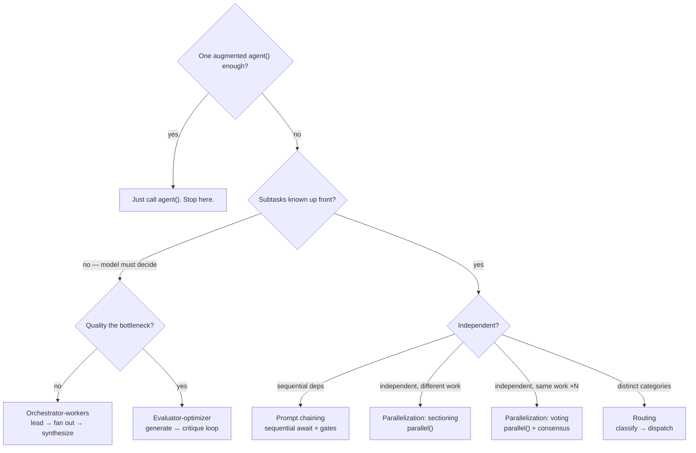

# Dynamic Workflow Design Patterns — External / Canonical Sources

> Companion to `CLAUDE_WORKFLOW_PATTERNS.md` (which reverse-engineers the two *shipped* workflows). This doc collects the design patterns **from published sources** — Anthropic's own guidance and the wider multi-agent literature — and maps each one onto the dynamic Workflow `.js` SDK primitives (`agent` / `parallel` / `pipeline` / `phase` / `log` / `budget` / `workflow`). Nothing here is read out of the binary; everything is cited.

## Provenance

| # | Source | What it gives |
|---|--------|---------------|
| S1 | Anthropic — *Building Effective Agents* | The 5 canonical workflow patterns + autonomous agent + augmented-LLM building block, with when-to-use and tradeoffs |
| S2 | Anthropic Engineering — *How we built our multi-agent research system* | Production orchestrator-worker rules of thumb, effort scaling, token economics, eval, resumability |
| S3 | HuggingFace — *Design Patterns for Building Agentic Workflows* (dcarpintero) | Same 5 patterns + context-augmentation framing, stopping-criteria detail, pattern-selection logic |
| S4 | arXiv 2605.13850 — *A Two-Dimensional Framework for AI Agent Design Patterns* | Cognitive-function × execution-topology taxonomy |
| S5 | Community guides (Augment Code, Jinba, DEV) | The 5-topology vocabulary: sequential / parallel / hierarchical / handoff / loop |

The two Anthropic sources (S1, S2) are authoritative; the rest corroborate and add vocabulary. **Key framing from S1: "workflows orchestrate LLMs through predefined code paths; agents direct their own process."** The Workflow SDK is a *workflow* engine — the code path is your `.js`; each `agent()` may itself be agentic.

---

## The building block: Augmented LLM (S1)

Every pattern composes one primitive: an LLM with **retrieval + tools + memory**. In the SDK that primitive is a single `agent()` call — its tools, model, effort, and (via `schema`) output contract are the augmentation.

```js
const r = await agent(PROMPT, { schema: OUT, model: "claude-sonnet-4-6", effort: "high" })
```

Everything below is **how you wire many of these together**. S1's prime directive: *don't* — until a single augmented call provably falls short.

---

## Pattern catalog (each mapped to the SDK)



### 1. Prompt chaining — *sequential, with gates* (S1, S3)

Decompose into fixed steps; each consumes the prior output; a **programmatic gate** between steps catches errors before they cascade. Trades latency for accuracy. Use when the decomposition is known and stable.

```js
phase("Chain")
const outline = await agent(OUTLINE_PROMPT, { schema: OUTLINE })
if (!gateOk(outline)) return { error: "outline failed gate" }   // <-- the checkpoint
const draft   = await agent(writePrompt(outline), { schema: DRAFT })
const final   = await agent(polishPrompt(draft),  { schema: FINAL })
```

SDK note: a single-item `pipeline([x], s1, s2, s3)` expresses the same chain; plain sequential `await`s are clearer for one item. Gate = a normal `if` between awaits.

### 2. Routing — *classify, then dispatch* (S1, S3)

One cheap classifier picks the path; each path is a specialized prompt/model. Keeps any one prompt from being optimized into mediocrity for all cases. **Classification accuracy is the whole game.**

```js
const { route } = await agent(CLASSIFY_PROMPT, { schema: ROUTE, model: "claude-haiku-4-5", effort: "low" })
const handler = {
  refund:  () => agent(REFUND_PROMPT,  { schema: OUT }),
  bug:     () => agent(BUG_PROMPT,     { schema: OUT, effort: "high" }),
  general: () => agent(GENERAL_PROMPT, { schema: OUT }),
}[route] ?? (() => agent(FALLBACK_PROMPT, { schema: OUT }))
const result = await handler()
```

SDK note: routing is just JS control flow over `agent()` — `switch`/map dispatch. Route to a different `model`/`effort` per branch (cheap model for easy, `high` for hard) — that's S1's "route by difficulty."

### 3. Parallelization — sectioning (S1, S3)

Independent subtasks run **concurrently**, results aggregated. S1's rule: *"LLMs perform better when each consideration is a separate call."* Use `parallel()` (barrier) when you genuinely need all sections together.

```js
const [security, style, tests] = await parallel([
  () => agent(SECURITY_PROMPT, { schema: F, phase: "Review" }),
  () => agent(STYLE_PROMPT,    { schema: F, phase: "Review" }),
  () => agent(TEST_PROMPT,     { schema: F, phase: "Review" }),
])
```

### 4. Parallelization — voting (S1, S3)

**Run the same task N times** for diverse takes, then aggregate by consensus. Higher confidence at N× cost. S1's example is exactly multi-pass security review / content moderation.

```js
const VOTES = 3
const verdicts = (await parallel(Array.from({ length: VOTES }, (_, i) =>
  () => agent(`${REVIEW_PROMPT}\n(reviewer ${i}: be independent and skeptical)`, { schema: VERDICT })
))).filter(Boolean)
const flagged = verdicts.filter(v => v.vulnerable).length >= 2   // majority
```

> This is the published form of the binary's **N-vote adversarial quorum** (`VOTES_PER_CLAIM=3`, `REFUTATIONS_REQUIRED=2`) — see `CLAUDE_WORKFLOW_PATTERNS.md` §4. Vary the prompt by index `i` (the SDK forbids `Math.random()`, so index *is* your diversity source).

### 5. Orchestrator-workers — *dynamic subtasks* (S1, S2, S3)

A lead agent **decides the subtasks at runtime** (you can't predict them), spawns workers, synthesizes. This is the multi-agent-research backbone and the SDK's sweet spot. Differs from sectioning: the **count and shape of work come from the model**, not hard-coded.

```js
phase("Plan")
const plan = await agent(LEAD_PROMPT, { schema: PLAN })          // model emits N subtasks
phase("Workers")
const parts = await parallel(plan.subtasks.map(t =>
  () => agent(workerPrompt(t), { label: t.id, schema: PART })))
phase("Synthesize")
return agent(synthPrompt(parts.filter(Boolean)), { schema: REPORT })
```

Tradeoff (S1): most complex pattern; needs robust error handling + synthesis. Orchestrator is the bottleneck (S3) — push bulk to workers, keep the lead thin.

### 6. Evaluator-optimizer — *generate ↔ critique loop* (S1, S3) + Reflection

One agent generates; another **evaluates against criteria and feeds back**; loop until a quality gate or budget cap. Use when (a) responses improve with feedback and (b) the model can produce that feedback. **Reflection** is the self-critique special case (same agent critiques itself).

```js
let draft = await agent(GEN_PROMPT, { schema: DRAFT })
for (let i = 0; i < 4; i++) {                                    // hard iteration cap (S3 stopping criteria)
  const review = await agent(evalPrompt(draft), { schema: CRITIQUE, effort: "high" })
  if (review.score >= 0.9) break
  draft = await agent(refinePrompt(draft, review), { schema: DRAFT })
}
return draft
```

> S3 names the stopping criteria explicitly: **quality gate, iteration limit, token budget, or similarity check** — never an unbounded `while`. Budget-gate it: `while (budget.total && budget.remaining() > 50_000 && score < 0.9)`.

### 7. Autonomous agent (S1)

The agent itself chooses its steps with tools, getting ground truth from the environment each loop; humans gate at checkpoints. In the SDK you don't *build* this in the script — you **delegate to one** via `agentType`, and let that subagent run its own loop:

```js
const fix = await agent("Resolve this failing test end-to-end.", {
  agentType: "general-purpose", isolation: "worktree", effort: "high"
})
```

Tradeoff (S1): highest cost, **compounding errors** — sandbox it (`isolation: "worktree"`) and cap it.

### 8. Map-reduce (S4) / fan-out → reduce

Dispatch isolated workers over data shards (**map**), then a single agent combines (**reduce**). The SDK-idiomatic form streams with `pipeline()` so each shard reduces as it lands — no barrier:

```js
const mapped = await pipeline(
  shards,
  shard => agent(mapPrompt(shard), { schema: PARTIAL, phase: "Map" }),
  (partial, shard, i) => agent(reducePrompt(partial, i), { schema: REDUCED, phase: "Reduce" })
)
// or a true reduce (barrier) when the combiner needs ALL partials at once:
const all = await parallel(shards.map(s => () => agent(mapPrompt(s), { schema: PARTIAL })))
return agent(combinePrompt(all.filter(Boolean)), { schema: FINAL })
```

Rule (from the SDK guidance): **`pipeline` by default; `parallel` barrier only when the reducer needs every partial together** (dedup/merge/early-exit on zero).

### 9. Plan-and-execute / planning (S4, S5 "sequential+hierarchical")

A lead emits a typed plan up front; the body executes it deterministically. This is the binary's **Scope-first** pattern (`CLAUDE_WORKFLOW_PATTERNS.md` §1) and the production lead-agent behavior (S2) combined. Difference vs orchestrator-workers: the plan is produced once, then *the script* drives execution rather than the model re-deciding.

---

## Production rules of thumb (S2) — and the SDK lever for each

These are the lessons from the real research system. Each maps to a concrete SDK move.

| S2 lesson | SDK expression |
|-----------|----------------|
| **Scale effort to query complexity** — 1 agent for facts, 2-4 for comparisons, 10+ for deep research | Branch fan-out on `budget.total` / a complexity score: `const FLEET = budget.total ? Math.floor(budget.total/100_000) : 4`. Mirrors the binary `PARAMS[effort]` table. |
| **Teach delegation clearly** — each worker needs objective, format, sources, **boundaries** | Put all four in the worker prompt; enforce *format* with `schema`. Vague prompts → duplicated work. |
| **Start broad, then narrow** | Two phases: a broad scout `agent`, then narrow workers seeded by its output. |
| **Separate citation pass** | A final dedicated `agent()` that only attributes claims to sources — never inline during research. (Binary deep-research does the same.) |
| **Filesystem over "telephone game"** — pass references, not copies, through the chain | Return lightweight IDs/handles from a stage; let the next stage fetch. Avoids carrying big blobs across the 4096-item / preview-clipped boundary. |
| **Heuristics over rigid rules** | Prompt workers with strategies (decompose, judge source quality, adapt), not rigid step lists. |
| **LLM-as-judge: one call, 0.0–1.0 + pass/fail** on a fixed rubric (accuracy, citations, completeness, source quality, tool efficiency) | A verifier/judge `agent` with a numeric `schema`. Single-call judge beat multi-call in their tests. |
| **Start eval at ~20 real queries** | Don't gate the workflow on a giant eval set; iterate on a handful — early changes dominate. |
| **Checkpoints + resumability** — resume from failure, retry logic, summarize phases to external memory | The SDK gives this natively: `Workflow({ scriptPath, resumeFromRunId })` replays cached agents (0 tokens). `null`-on-failure + `.filter(Boolean)` is the deterministic safeguard. |
| **Token economics**: agents ≈ 4× chat, multi-agent ≈ 15×; **token usage alone explains ~80% of performance variance** (tool calls + model = the rest) | Spend deliberately: more/`high`-effort agents buy quality but cost 15×. Gate on `budget` and report cost with `log()`. |
| **Agents self-improve** — Claude 4 can rewrite weak prompts/tool docs (40% faster in their test) | A meta `agent()` that critiques and rewrites a downstream prompt before the run uses it. |

---

## Two-dimensional taxonomy (S4) → SDK

S4 frames every pattern as **cognitive function × execution topology**. The SDK supplies the topology axis directly:

| Topology (S4/S5) | SDK construct |
|------------------|---------------|
| Chain (sequential) | sequential `await`s / single-item `pipeline` |
| Route (handoff) | JS `switch`/map over `agent()` |
| Parallel (fan-out/in) | `parallel()` (barrier) |
| Orchestrate (hierarchy) | lead `agent()` → `parallel`/`pipeline` of workers |
| Loop (iteration) | `for`/`while` (budget-gated) around `agent()` |
| Hierarchy (nested) | `workflow()` child call (**one level only**) |

Cognitive function (reasoning / reflection / collaboration / memory / governance) is carried *inside* each `agent()` via prompt + `effort` + `schema`. The script owns topology; the agent owns cognition.

---

## Pattern-selection decision tree (synthesized from S1/S3/S4)



Decision logic, stated (S3): accuracy/quality → evaluator-optimizer; knowledge gap → context-augmentation (tools); decomposable+sequential → chaining; independent → parallelization; fixed categories → routing; dynamic/unpredictable → orchestrator-workers.

---

## Master map: canonical pattern → SDK → also in the shipped workflows?

| Canonical pattern (S1/S3) | SDK primitive | Found in binary? (`CLAUDE_WORKFLOW_PATTERNS.md`) |
|---------------------------|---------------|--------------------------------------------------|
| Prompt chaining | sequential `await` / 1-item `pipeline` | partial (Scope→Find→Verify is a chain of phases) |
| Routing | `switch`/map over `agent()` | no (no runtime branching in the two scripts) |
| Parallelization — sectioning | `parallel()` | §2 (finder fan-out across angles) |
| Parallelization — voting | `parallel()` + consensus | **§4** (3-vote adversarial quorum) |
| Orchestrator-workers | lead `agent` → `parallel`/`pipeline` | **§1+§2** (the whole backbone) |
| Evaluator-optimizer / reflection | `for`/`while` + judge `agent` | **§3** (independent verifier per candidate) |
| Map-reduce | `pipeline` (stream) / `parallel`+reduce | §5 (dedup-at-synthesis = the reduce) |
| Autonomous agent | `agent({ agentType, isolation })` | n/a (workers are scoped, not autonomous) |
| Scale effort to complexity | branch on `budget` / score | **§8** (`PARAMS[effort]` table) |
| Separate citation pass | final attribution `agent()` | yes (deep-research citation step) |
| Resumability / checkpoints | `resumeFromRunId` replay | engine-level (see internals §9) |

**Takeaway:** the shipped workflows are a focused composition — *orchestrator-workers + sectioning + voting + reflection + map-reduce-at-synthesis + effort-scaling*. The patterns the binary does **not** use (routing, evaluator-optimizer loops, autonomous-agent delegation) are still expressible in the SDK; they're just not what review/research happen to need.

---

## Sources

- [Anthropic — Building Effective Agents](https://www.anthropic.com/research/building-effective-agents) (S1)
- [Anthropic Engineering — How we built our multi-agent research system](https://www.anthropic.com/engineering/built-multi-agent-research-system) (S2)
- [HuggingFace — Design Patterns for Building Agentic Workflows](https://huggingface.co/blog/dcarpintero/design-patterns-for-building-agentic-workflows) (S3)
- [arXiv 2605.13850 — A Two-Dimensional Framework for AI Agent Design Patterns](https://arxiv.org/html/2605.13850v1) (S4)
- [Augment Code — Agentic Design Patterns / Architecture Patterns](https://www.augmentcode.com/guides/agentic-design-patterns), [Jinba — 7 Orchestration Patterns](https://jinba.io/blog/ai-agent-orchestration-patterns), [DEV — Patterns That Work](https://dev.to/thedailyagent/multi-agent-orchestration-a-guide-to-patterns-that-work-1h81) (S5)
