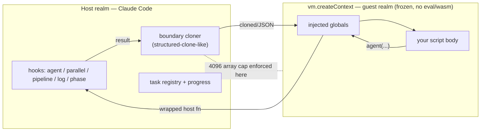

# Claude Code Workflow Runtime — Internals (reverse-engineered)

> Derived by reverse-engineering the Claude Code binary, **v2.1.193**, by grepping the embedded JS for the exact error strings the black-box tests triggered, then extracting and beautifying the surrounding minified code. Everything here is read off the shipped bundle; line references are into a locally beautified extract, not stable across versions.

## 1. Packaging

| Fact | Value |
|------|-------|
| Binary | `~/.local/share/claude/versions/2.1.193` (symlinked from `~/.local/bin/claude`) |
| Format | Mach-O 64-bit arm64, **Bun single-file executable** |
| Size | ~212 MB |
| Source | JavaScript is **embedded as plaintext** inside the binary (greppable); the workflow stack traces (`/$bunfs/root/src/entrypoints/cli.js`) are Bun's in-binary virtual FS |

The workflow runtime lives in two code regions: a **tool-layer validator** (~byte 186M) and the **VM runtime** (~byte 208M). The split matters — see §4.

## 2. Engine: it's `node:vm`, not a Worker

The script does **not** run in a Worker thread or `isolated-vm`. It runs in an in-process **V8 context** via Node's built-in `vm` module:

```js
require("vm")               // aliased per-scope as Hre / bGn / wGn / x8t
ctx = vm.createContext(globals, { codeGeneration: { strings: false, wasm: false } })
vm.runInContext(scriptOrExpr, ctx, { timeout: 30000 })
```

- `codeGeneration: { strings: false, wasm: false }` ⇒ **`eval` / `new Function` / WASM are disabled** inside the sandbox.
- The host and the context are two different V8 realms in the same process. The **"workflow VM boundary"** in error messages is the membrane between them.



## 3. Sandbox hardening (the script is treated as semi-untrusted)

Before the script runs, the runtime **locks the guest realm**. Observed in the bundle:

- **Deep intrinsic freeze.** `Object.freeze` over the prototypes and constructors of `Object, Array, Function, Date, RegExp, Promise, Map, Set, WeakMap, WeakSet, String, Number, Boolean, Symbol, BigInt, ArrayBuffer, DataView, URL`, every TypedArray (`%TypedArray%` + concretes), the async/generator function constructors, `Intl`, `DisposableStack`, and all `Error` subclasses.
- **Namespace freeze with an explicit escape rationale.** `JSON, Math, Reflect, Proxy` are frozen with this comment in the source:

  > *Namespace objects (no .prototype) — VM code could otherwise set `JSON.then`/`Math.then`/`Reflect.then` and any host await on the namespace object (or on a VM value that aliases it) becomes a thenable escape.*

  i.e. they are actively defending the **host** against the **workflow script** trying to break out by planting a `.then` thenable.
- `enableOverride(...)` selectively keeps `toString`/`constructor`/`name`/`length` overridable while everything else is frozen.

This is sandbox-escape defense, not just ergonomics — the comments literally call guest values "attacker-reachable."

## 4. Determinism: two enforcement layers

### Layer A — submit-time static scan (tool layer, ~186M)

When you launch a workflow, the **tool handler** rejects the script *before it runs* if it contains the banned tokens. This is the error you cannot `try/catch`:

```
Workflow scripts must be deterministic: Date.now()/Math.random()/new Date()
are unavailable (breaks resume). …
```

It is a **token scan** — it trips on the literal `new Date(`, which is why even `new Date(0)` (argument form) is refused at submit.

### Layer B — runtime shims (VM layer, ~208M)

Defense-in-depth inside the context. The actual shipped shim:

```js
Math.random = function random() { throw new Error(RANDOM_ERR) }

const RealDate = Date;
RealDate.now = function now() { throw new Error(NOW_ERR) }

function ShimDate(...a) {
  if (!new.target)     throw new Error(NOW_ERR);   // bare Date()  → now-string blocked
  if (a.length === 0)  throw new Error(NOW_ERR);   // new Date()   → blocked
  return Reflect.construct(RealDate, a, new.target); // new Date(x) → ALLOWED at runtime
}
ShimDate.now = RealDate.now; ShimDate.parse = RealDate.parse; ShimDate.UTC = RealDate.UTC;
ShimDate.prototype = RealDate.prototype;
// close the (new Date(x)).constructor backdoor to RealDate.now, then freeze RealDate
RealDate.prototype.constructor = ShimDate;
```

Insight: **the runtime would actually permit `new Date(x)` (argument form)** — only `Date.now()`, bare `Date()`, and `new Date()` throw. The reason you still can't use `new Date(0)` is **Layer A** blocking the token first. They also close the `(new Date(x)).constructor.now()` backdoor by repointing the constructor and freezing `RealDate`.

> Error message strings carried in the bundle:
> - `Date.now() / new Date() are unavailable in workflow scripts (breaks resume). Stamp results after the workflow returns, or pass timestamps via args.`
> - `Math.random() is unavailable in workflow scripts (breaks resume). For N independent samples, include the index in the agent label or prompt.`

## 5. Injected globals — and why `console` / `setTimeout` work

The globals object handed to `createContext` (host functions wrapped through the membrane):

```js
{
  __proto__: null,
  budget,                       // the token-budget object
  setTimeout:  host.timers.setTimeout,    // real host timer  → that's why setTimeout works
  clearTimeout: host.timers.clearTimeout,
  phase:  wrap(h => hooks.resolvePhase(...)),
  log:    wrap(h => hooks.log(prefix + h)),
  console: makeConsole(h => hooks.log(prefix + h)),  // console.* is ROUTED to hooks.log
  agent:   (prompt, opts) => hooks.agent(prompt, { ...cloneOpts(opts), phase: current }),
  parallel: hooks.parallel,
  pipeline: hooks.pipeline,
  workflow: /* parent: real; child: */ () => Promise.reject(
    Error("workflow() cannot be called from within a child workflow — nesting is limited to one level. …")),
}
// args is attached separately:
Object.defineProperty(ctx, "args", { value: …, writable: true, enumerable: true, configurable: true })
```

Explains the black-box surprises:

- **`console.log` "works"** because `console` is a shim whose every method calls `hooks.log` — output shows up as a workflow narrator line, not real stdout.
- **`setTimeout` works** because it's the genuine host timer, injected by reference. `setInterval` is *not* in the list → absent.
- **Child workflows can't nest** because in a child context the `workflow` global is replaced by a rejecting stub (the nesting error is generated right here, not by the child it would have called).

### `agent()` opts + schema

The `agent` wrapper clones the opts object across the membrane and extracts `schema` specially, caching it in a `WeakMap` keyed on the schema object so repeated calls with the same schema reference reuse it. The current `phase` is force-injected (`{ ...opts, phase: current }`), which is why an explicit `phase` inside a stage matters.

## 6. The boundary cloner + the 4096 cap

Values crossing host↔guest go through a **structured-clone-like deep cloner** with a hardened design (the source comments describe guarding against "cloner parent-VM (attacker-reachable) values as childArgs"). The array-length guard lives **in the cloner**:

```
unable to read array length across the workflow VM boundary
array length is not a safe integer across the workflow VM boundary
array length <N> exceeds the maximum of 4096 supported across the workflow VM boundary
```

So the **4096-item cap is a marshalling limit**, not a scheduler limit — it's the max array length the cloner will carry across the boundary in one call. (It is catchable because it throws as a normal rejection during the `parallel`/`pipeline` call.)

## 7. The `args` stringification — root cause

Two different code paths attach `args`, and they behave differently:

```js
// top-level workflow path (the one the Workflow tool uses):
let E = (s === undefined) ? undefined : JSON.stringify(s);
Object.defineProperty(ctx, "args", {
  value: (E === undefined) ? undefined
       : vm.runInContext(`JSON.parse(${JSON.stringify(E)})`, ctx),
  ...
});

// child-workflow path:
Object.defineProperty(ctx, "args", { value: (o === undefined) ? undefined : clone(o), ... });
```

The top-level path JSON-serializes the host args and round-trips them into the context. Because the host value arrives here **already JSON-encoded once**, the net effect delivered to the script is the **JSON text as a string** — exactly the observed behavior (`args === "[1, 2, 3]"`, `typeof === "string"`). The child path uses the structured-clone `clone(o)` instead.

**Practical rule (confirmed by source):** at the top level always `JSON.parse(args)`.

## 8. Synchronous execution timeout

```js
vm.runInContext(compiledScript, ctx, { timeout: 30000 })   // AGn = 30000
```

The `vm` timeout bounds **synchronous** execution only. Awaiting an `agent()` (which suspends back to the host) does not count, so multi-minute workflows run fine — but a **synchronous infinite loop** in the script body is killed at ~30 s. There is no total wall-clock cap from this knob (the 1000-agent cap is the runaway backstop instead).

## 9. Run-state model

The task registry entry for a run (field names from the bundle):

```
taskId, type:"local_workflow", status, script, scriptPath, args, summary,
workflowName, title, phases, defaultModel, workflowRunId,
workflowProgress[], progressVersion, agentCount, totalTokens, totalToolCalls,
logs[], abortController, agentControllers: Map
```

- `agentControllers` (a `Map`) is how individual agents are stopped/restarted from `/workflows`.
- `workflowProgress[]` + `progressVersion` drive the live progress view.
- Resume works by replaying cached agent results against this journal — consistent with the observed 0-token, 15 ms cache-hit re-run.

## 10. How black-box findings map to the source

| Earlier observation | Internals cause |
|---------------------|-----------------|
| `args` arrives as a string | top-level args path JSON round-trips an already-encoded value (§7) |
| `console.log` works | `console` shim routes to `hooks.log` (§5) |
| `setTimeout` works, `setInterval` absent | only `setTimeout`/`clearTimeout` injected (§5) |
| `Date.now`/`Math.random`/`new Date` rejected, uncatchable | static submit scan, Layer A, before run (§4) |
| `new Date(0)` also rejected | token scan trips on `new Date(` even though runtime shim would allow it (§4) |
| no in-script clock | `Date` shimmed + `performance` never injected |
| 4096-item cap, catchable | enforced in the boundary cloner as a normal throw (§6) |
| nesting depth 1, catchable in child | child `workflow` global is a rejecting stub (§5) |
| `effort`/unknown opts lenient; `agentType`/`isolation` strict | opts cloned & forwarded to host `hooks.agent`; validation happens host-side per-opt |
| resume = 0 tokens, instant | journal replay against the run-state model (§9) |

---

### Method note

Reverse engineering was done read-only on the user's own installed binary: locate (`which claude` → Mach-O), confirm the embedded strings the live tests produced, extract byte-offset windows around them, beautify, and read. No patching, no redistribution. Line numbers refer to a local beautified extract and will drift between versions.
