# Dynamic Workflows — Design Patterns

> Two complementary lenses: **Part A** reverse-engineers the two *production* workflow scripts shipped in Claude Code v2.1.193 (`code-review` and `deep-research`) — these are patterns Anthropic actually ships. **Part B** maps canonical patterns from published sources (Anthropic's own guidance + multi-agent literature) onto the SDK primitives. Each part informs the other.

Both scripts share one backbone — **Scope → fan-out Find → stream Verify → Synthesize** — and differ mainly in the verify strategy (single independent verifier vs N-vote quorum).

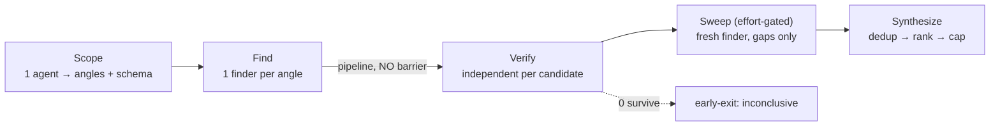

---

## Part A — Patterns from the shipped binary

### Pattern A1 — Scope first, with a schema

A single lead agent pins the context and emits a **structured plan** (angles to pursue, the diff command, conventions) that the rest of the run consumes. Everything downstream keys off this object.

```js
phase("Scope")
const scope = await agent(SCOPE_PROMPT, { label: "scope", schema: SCOPE_SCHEMA })
// scope.angles drives the finder fan-out; scope also carries diff cmd, files, conventions
```

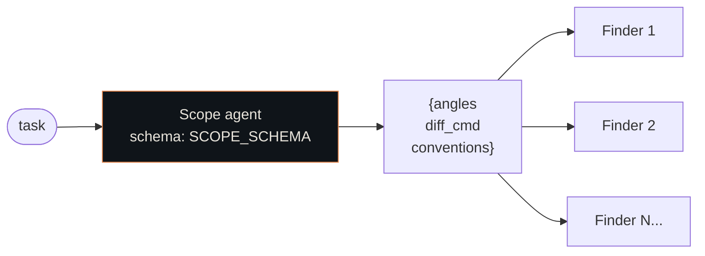

Why: one cheap agent turns a vague task into a typed work-list the script can iterate deterministically.

---

### Pattern A2 — Stream find → verify with `pipeline` (no barrier)

Finders fan out, and **each finder's candidates are verified the moment that finder returns** — not after all finders finish. This is the canonical use of `pipeline()` (the second stage is itself a `parallel` over that finder's candidates).

```js
const FINDERS = CORRECTNESS_ANGLES.slice(0, P.correctnessAngles).map(a => ({ ...a, kind: "correctness" }))
  .concat(CLEANUP_ANGLES.map(a => ({ ...a, kind: "cleanup" })))

const finderResults = await pipeline(
  FINDERS,
  f => agent(FINDER_PROMPT(f), { label: f.label, phase: "Find", schema: CANDIDATES_SCHEMA })
        .then(r => ({ finder: f, candidates: (r?.candidates ?? []).slice(0, P.perAngle) })),
  result => parallel(result.candidates.map(c => () => verifyCandidate({ ...c, kind: result.finder.kind })))
)
let verified = finderResults.flat().filter(Boolean)
```

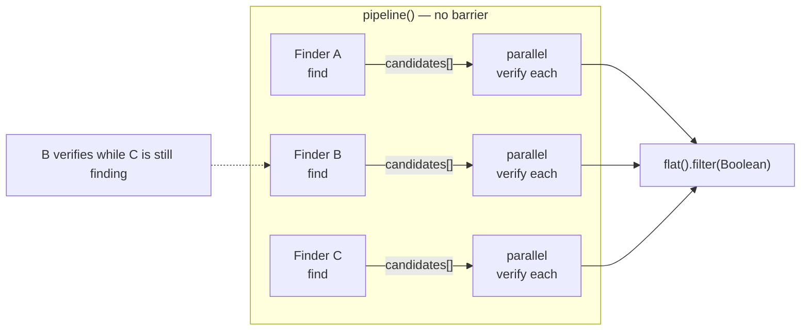

Why: a slow finder never blocks a fast finder's verification. Wall-clock = slowest single finder→verify chain.

---

### Pattern A3 — One independent verifier per candidate (adversarial, structured verdict)

Every candidate gets its **own** verifier agent with a **verdict ladder** and a requirement to cite evidence.

> *No pre-verify dedup — every candidate gets a verifier; dedup happens once at synthesis.*

```js
function verifyCandidate(c) {
  return agent(VERIFIER_PROMPT(c), { label: "verify:" + base(c.file), phase: "Verify", schema: VERDICT_SCHEMA })
    .then(v => v ? { ...c, verdict: v.verdict, evidence: v.evidence } : null)  // null = skip/error
}
// verdict ∈ { CONFIRMED, PLAUSIBLE, REFUTED }; evidence must quote the relevant line(s)
const surviving = verified.filter(c => c.verdict !== "REFUTED")
```

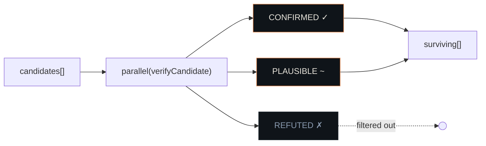

Why: independent adjudication kills plausible-but-wrong findings; structured verdicts make the reduce step mechanical.

---

### Pattern A4 — N-vote adversarial quorum (deep-research)

For claims with no ground truth, run **N skeptical voters per claim**, each told to *refute*. A claim survives only if it was **actually adjudicated** (quorum of valid votes) **and** under the refutation threshold. Abstentions (null votes) must not count as a pass.

```js
const VOTES_PER_CLAIM = 3
const REFUTATIONS_REQUIRED = 2          // ≥2 of 3 refutations kill it

const voted = (await parallel(rankedClaims.map(claim => () =>
  parallel(Array.from({ length: VOTES_PER_CLAIM }, (_, v) => () =>
    agent(VERIFY_PROMPT(claim, v), { label: "v"+v, phase: "Verify", schema: VERDICT_SCHEMA })
  )).then(verdicts => {
    const valid    = verdicts.filter(Boolean)             // a vote can be null → abstain
    const refuted  = valid.filter(v => v.refuted).length
    const survives = valid.length >= REFUTATIONS_REQUIRED && refuted < REFUTATIONS_REQUIRED
    return { ...claim, survives }
  })
))).filter(Boolean)
const confirmed = voted.filter(c => c.survives)
```

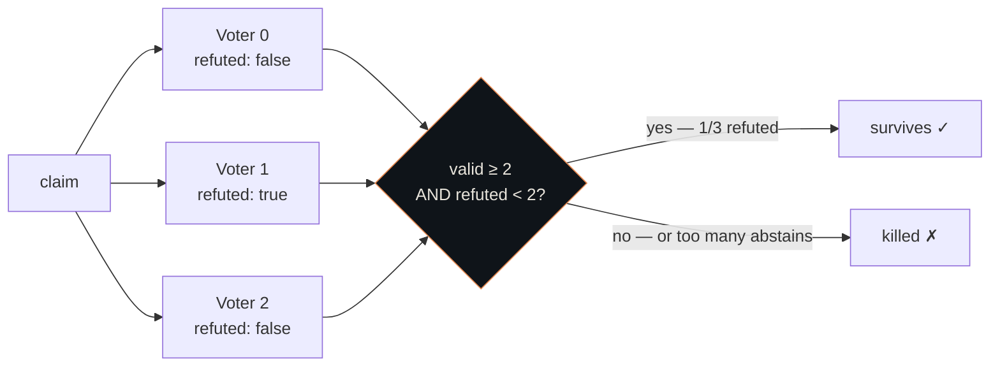

> *Too many abstentions = unverified, which must NOT pass into the report (otherwise all-abstain → refuted=0 → false survive).*

Why: majority-refute voting is more robust than a single verifier when the claim can be wrong in subtle ways; the quorum guard prevents silent passes.

---

### Pattern A5 — Dedup once, at synthesis (never before verify)

Neither script dedups before verifying. Duplicates are merged **only** in the final synthesis agent, which also ranks and caps.

```js
// SYNTHESIS_SCHEMA carries a "duplicate_of" field: [i] labels folded into one finding
phase("Synthesize")
const report = await agent(SYNTHESIS_PROMPT(surviving), { label: "synthesize", schema: REPORT_SCHEMA })
// "Keep at most P.maxFindings decisions" — the model merges semantic dups, you cap the list
for (let i = 0; i < ranked.length && findings.length < P.maxFindings; i++) { /* ... */ }
```

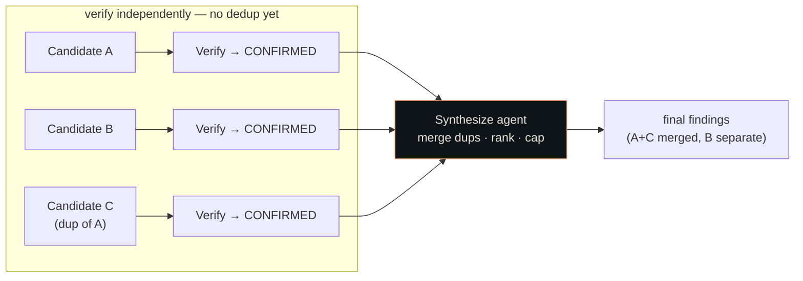

Why: deduping early can drop a real finding that merely *looked* like another. Verify everything independently; collapse at the end.

---

### Pattern A6 — Completeness sweep, effort-gated

At high effort only, a **fresh finder** is handed the already-found list and told to hunt **only gaps** — and to return empty rather than pad.

```js
if (P.sweep) {
  phase("Sweep")
  const known = verified.map(c => "- " + c.file + ":" + c.line + " — " + c.summary).join("\n")
  const sweep = await agent(
    SCOPE_BLOCK + "\nAlready-found (do NOT re-derive):\n" + known +
    "\nLook ONLY for defects not listed. Focus on what the first pass misses: " + SWEEP_GAP_FOCUS +
    "\nUp to " + SWEEP_MAX + " more. If nothing new, return an empty list — do not pad.",
    { label: "sweep", phase: "Sweep", schema: CANDIDATES_SCHEMA })
  if (sweep?.candidates.length)
    verified = verified.concat((await parallel(sweep.candidates.slice(0, SWEEP_MAX)
      .map(c => () => verifyCandidate({ ...c, kind: "correctness" })))).filter(Boolean))
}
```

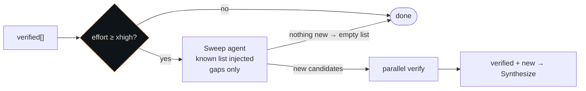

Why: the first pass has blind spots; a gap-only finder with the known list catches the tail without re-confirming what's done.

---

### Pattern A7 — Early-exit on empty

If verification kills everything, return an explicit "inconclusive / no findings" result **with stats** instead of synthesizing nothing.

```js
if (confirmed.length === 0) {
  return { question: QUESTION, summary: "All claims refuted by adversarial verification…",
           findings: [], refuted: killed.map(...), stats: { ...counts, confirmed: 0 } }
}
```

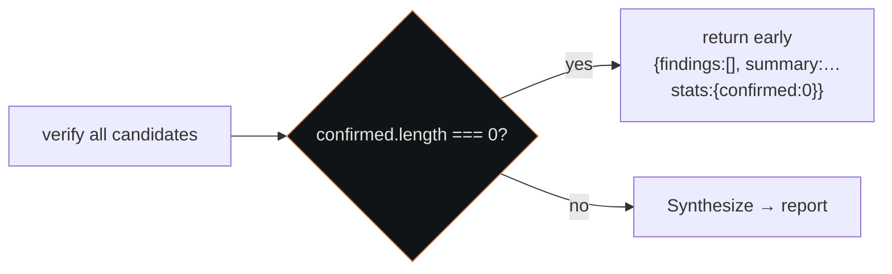

Why: a empty synthesis is wasted tokens and a confusing report; surface the negative result honestly.

---

### Pattern A8 — Effort-scaled fan-out (the parameter table)

Both scripts read a **config keyed by effort level** and scale breadth, not just the per-agent reasoning. From `code-review`:

```js
const PARAMS = {
  high:  { correctnessAngles: 3, perAngle: 6, maxFindings: 10, sweep: false },  // precision, 1-vote verify
  xhigh: { correctnessAngles: 5, perAngle: 8, maxFindings: 15, sweep: true  },  // recall
  max:   { correctnessAngles: 5, perAngle: 8, maxFindings: 15, sweep: true  },  // same fan-out as xhigh…
}
const SWEEP_MAX = 8
// shipped comment: "max → same structure as xhigh (the API reasoning effort differs, not the fan-out)"
```

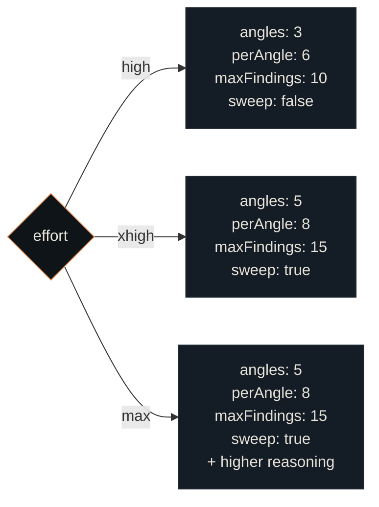

Key insight: **`max` vs `xhigh` changes the per-agent reasoning effort, not the number of agents.** Breadth is tuned by the table; depth by `effort`. `high` is precision-biased (fewer angles, no sweep, 1-vote); `xhigh`/`max` are recall-biased (more angles, sweep on).

---

### Pattern A9 — Cost accounting

The script computes its own expected agent count for the stats block:

```js
agentCalls: 1 /*scope*/ + scope.angles.length + allSources.length
          + voted.length * VOTES_PER_CLAIM + 1 /*synthesize*/
```

Why: transparent cost, and a sanity check against the 1000-agent cap.

---

### The two shapes side by side

| Stage | `code-review` | `deep-research` |
|-------|---------------|-----------------|
| Scope | diff cmd, files, conventions, angles | research angles + sub-questions |
| Find | finder per correctness + cleanup angle | search per angle (WebSearch) |
| (extract) | — | WebFetch → claims + source quality |
| Verify | 1 independent verifier/candidate, verdict ladder | **3-vote** adversarial quorum/claim |
| Sweep | gap-only finder (xhigh/max) | — |
| Synthesize | merge dups, rank, cap `maxFindings` | cited report, dedup, cap |
| Early-exit | — | if 0 claims survive |
| Scaling | `PARAMS[effort]` table | `VOTES_PER_CLAIM`, angle count |

---

## Part B — Canonical patterns (published sources)

> Patterns from Anthropic's public guidance and multi-agent literature, each mapped to the SDK primitives. Nothing here is read out of the binary; everything is cited.

### Provenance

| # | Source | What it gives |
|---|--------|---------------|
| S1 | Anthropic — *Building Effective Agents* | The 5 canonical workflow patterns + autonomous agent + augmented-LLM building block |
| S2 | Anthropic Engineering — *How we built our multi-agent research system* | Production orchestrator-worker rules of thumb, effort scaling, token economics, resumability |
| S3 | HuggingFace — *Design Patterns for Building Agentic Workflows* | Same 5 patterns + stopping-criteria detail, pattern-selection logic |
| S4 | arXiv 2605.13850 — *A Two-Dimensional Framework for AI Agent Design Patterns* | Cognitive-function × execution-topology taxonomy |
| S5 | Community guides | The 5-topology vocabulary: sequential / parallel / hierarchical / handoff / loop |

**Key framing from S1: "workflows orchestrate LLMs through predefined code paths; agents direct their own process."** The Workflow SDK is a *workflow* engine — the code path is your `.js`; each `agent()` may itself be agentic.

---

### The building block: Augmented LLM (S1)

Every pattern composes one primitive: an LLM with **retrieval + tools + memory**. In the SDK that primitive is a single `agent()` call — its tools, model, effort, and (via `schema`) output contract are the augmentation.

```js
const r = await agent(PROMPT, { schema: OUT, model: "claude-sonnet-4-6", effort: "high" })
```

Everything below is **how you wire many of these together**. S1's prime directive: *don't* — until a single augmented call provably falls short.

---

### Canonical pattern catalog

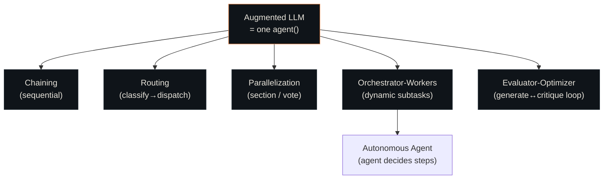

#### Pattern B1 — Prompt chaining — *sequential, with gates* (S1, S3)

Decompose into fixed steps; each consumes the prior output; a **programmatic gate** between steps catches errors before they cascade. Use when the decomposition is known and stable.

```js
phase("Chain")
const outline = await agent(OUTLINE_PROMPT, { schema: OUTLINE })
if (!gateOk(outline)) return { error: "outline failed gate" }   // <-- the checkpoint
const draft   = await agent(writePrompt(outline), { schema: DRAFT })
const final   = await agent(polishPrompt(draft),  { schema: FINAL })
```

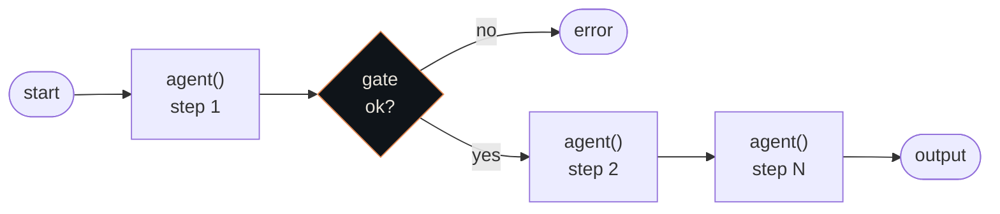

A single-item `pipeline([x], s1, s2, s3)` expresses the same chain; plain sequential `await`s are clearer for one item.

#### Pattern B2 — Routing — *classify, then dispatch* (S1, S3)

One cheap classifier picks the path; each path is a specialized prompt/model. **Classification accuracy is the whole game.**

```js
const { route } = await agent(CLASSIFY_PROMPT, { schema: ROUTE, model: "claude-haiku-4-5", effort: "low" })
const handler = {
  refund:  () => agent(REFUND_PROMPT,  { schema: OUT }),
  bug:     () => agent(BUG_PROMPT,     { schema: OUT, effort: "high" }),
  general: () => agent(GENERAL_PROMPT, { schema: OUT }),
}[route] ?? (() => agent(FALLBACK_PROMPT, { schema: OUT }))
const result = await handler()
```

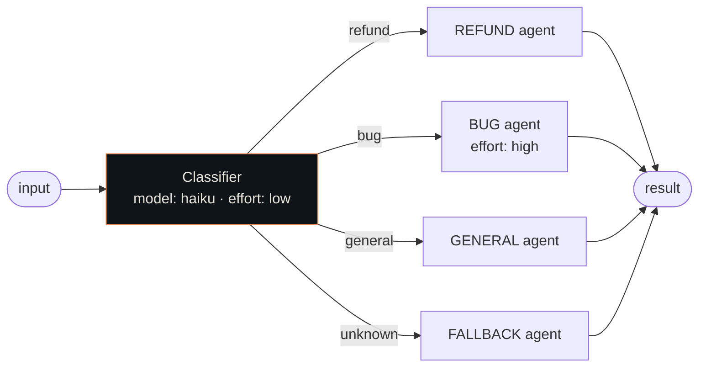

#### Pattern B3 — Parallelization — sectioning (S1, S3)

Independent subtasks run **concurrently**, results aggregated. Use `parallel()` (barrier) when you genuinely need all sections together.

```js
const [security, style, tests] = await parallel([
  () => agent(SECURITY_PROMPT, { schema: F, phase: "Review" }),
  () => agent(STYLE_PROMPT,    { schema: F, phase: "Review" }),
  () => agent(TEST_PROMPT,     { schema: F, phase: "Review" }),
])
```

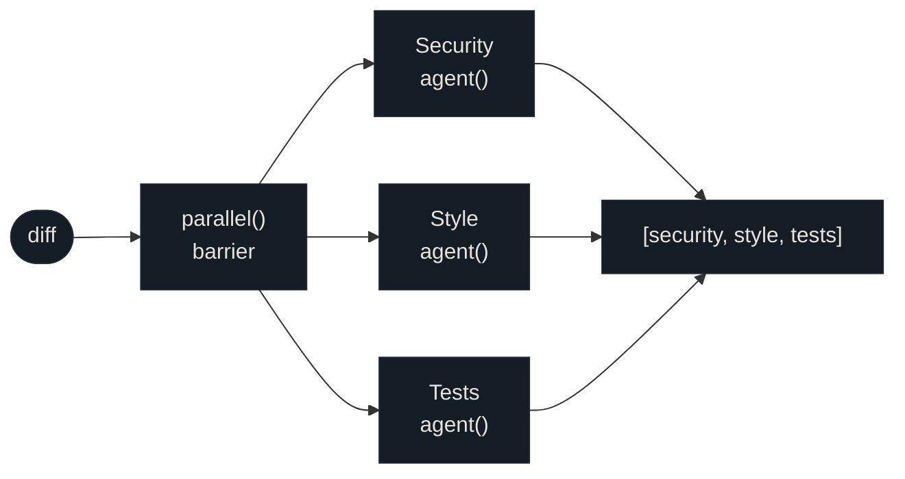

#### Pattern B4 — Parallelization — voting (S1, S3)

**Run the same task N times** for diverse takes, then aggregate by consensus. This is the published form of the binary's N-vote adversarial quorum (Pattern A4).

```js
const VOTES = 3
const verdicts = (await parallel(Array.from({ length: VOTES }, (_, i) =>
  () => agent(`${REVIEW_PROMPT}\n(reviewer ${i}: be independent and skeptical)`, { schema: VERDICT })
))).filter(Boolean)
const flagged = verdicts.filter(v => v.vulnerable).length >= 2   // majority
```

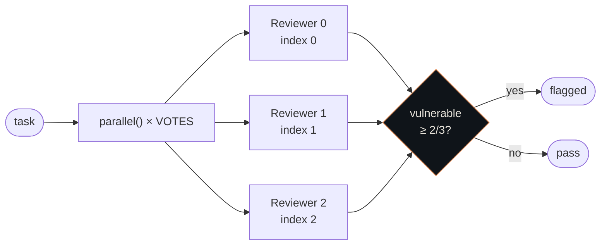

Vary the prompt by index `i` — the SDK forbids `Math.random()`, so index *is* your diversity source.

#### Pattern B5 — Orchestrator-workers — *dynamic subtasks* (S1, S2, S3)

A lead agent **decides the subtasks at runtime**, spawns workers, synthesizes. Differs from sectioning: the **count and shape of work come from the model**, not hard-coded.

```js
phase("Plan")
const plan = await agent(LEAD_PROMPT, { schema: PLAN })          // model emits N subtasks
phase("Workers")
const parts = await parallel(plan.subtasks.map(t =>
  () => agent(workerPrompt(t), { label: t.id, schema: PART })))
phase("Synthesize")
return agent(synthPrompt(parts.filter(Boolean)), { schema: REPORT })
```

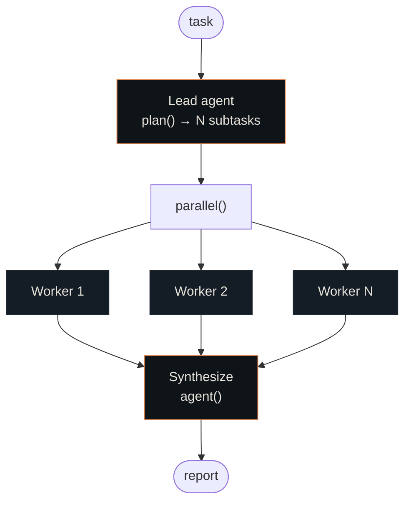

Push bulk to workers, keep the lead thin (S3 — orchestrator is the bottleneck).

#### Pattern B6 — Evaluator-optimizer — *generate ↔ critique loop* (S1, S3)

One agent generates; another evaluates and feeds back; loop until quality gate or budget cap.

```js
let draft = await agent(GEN_PROMPT, { schema: DRAFT })
for (let i = 0; i < 4; i++) {                                    // hard iteration cap
  const review = await agent(evalPrompt(draft), { schema: CRITIQUE, effort: "high" })
  if (review.score >= 0.9) break
  draft = await agent(refinePrompt(draft, review), { schema: DRAFT })
}
return draft
```

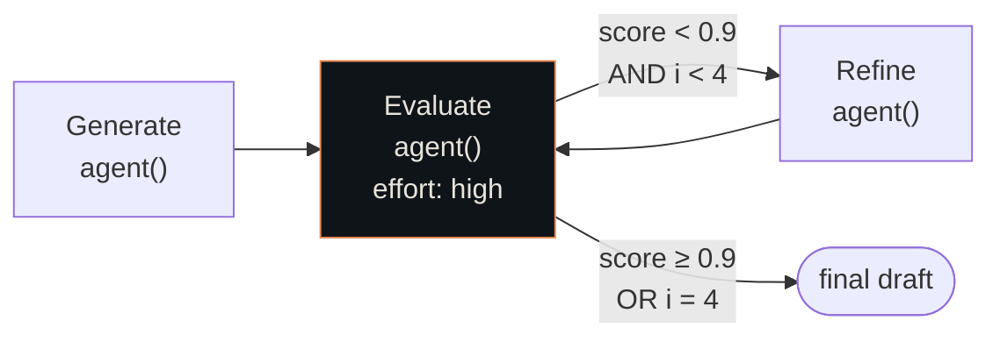

S3's stopping criteria: **quality gate, iteration limit, token budget, or similarity check** — never an unbounded `while`. Budget-gate it: `while (budget.total && budget.remaining() > 50_000 && score < 0.9)`.

#### Pattern B7 — Autonomous agent (S1)

Delegate to one fully agentic subagent via `agentType`. Sandbox it and cap it.

```js
const fix = await agent("Resolve this failing test end-to-end.", {
  agentType: "general-purpose", isolation: "worktree", effort: "high"
})
```

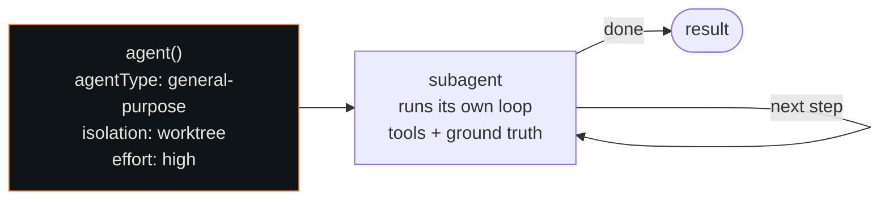

Tradeoff (S1): highest cost, **compounding errors** — `isolation: "worktree"` is load-bearing here.

#### Pattern B8 — Map-reduce (S4) / fan-out → reduce

Dispatch isolated workers over data shards (**map**), then a single agent combines (**reduce**). Default to `pipeline()` so each shard reduces as it lands:

```js
const mapped = await pipeline(
  shards,
  shard => agent(mapPrompt(shard), { schema: PARTIAL, phase: "Map" }),
  (partial, shard, i) => agent(reducePrompt(partial, i), { schema: REDUCED, phase: "Reduce" })
)
// barrier only when the combiner needs ALL partials at once:
const all = await parallel(shards.map(s => () => agent(mapPrompt(s), { schema: PARTIAL })))
return agent(combinePrompt(all.filter(Boolean)), { schema: FINAL })
```

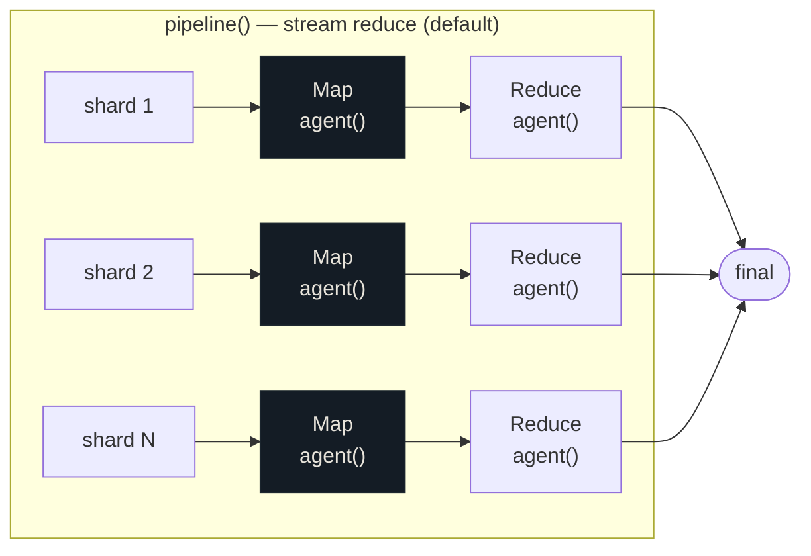

Rule: **`pipeline` by default; `parallel` barrier only when the reducer needs every partial together** (dedup/merge/early-exit on zero).

#### Pattern B9 — Plan-and-execute (S4, S5)

A lead emits a typed plan up front; the body executes it deterministically. Difference vs orchestrator-workers: the plan is produced once, then *the script* drives execution rather than the model re-deciding.

```js
phase("Plan")
const plan = await agent(LEAD_PROMPT, { schema: PLAN })
phase("Execute")
for (const step of plan.steps) {
  results.push(await agent(execPrompt(step), { label: step.id, schema: PART }))
}
```

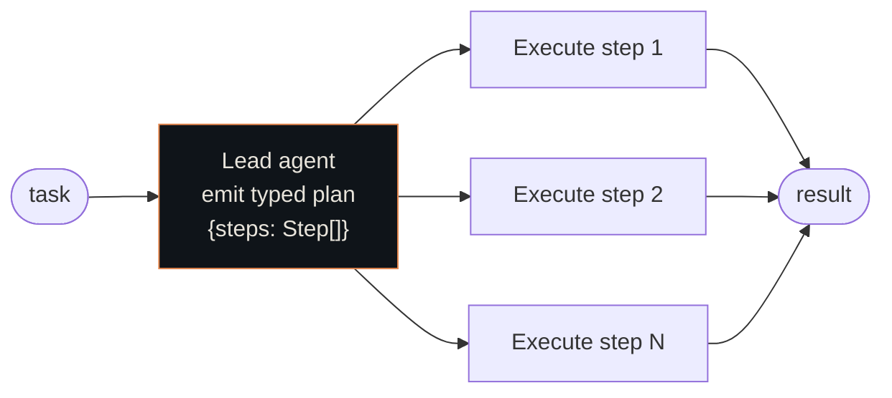

---

### Production rules of thumb (S2)

| S2 lesson | SDK expression |
|-----------|----------------|
| **Scale effort to query complexity** — 1 agent for facts, 2-4 for comparisons, 10+ for deep research | Branch fan-out on `budget.total` / a complexity score: `const FLEET = budget.total ? Math.floor(budget.total/100_000) : 4`. Mirrors the binary `PARAMS[effort]` table. |
| **Teach delegation clearly** — each worker needs objective, format, sources, **boundaries** | Put all four in the worker prompt; enforce *format* with `schema`. Vague prompts → duplicated work. |
| **Start broad, then narrow** | Two phases: a broad scout `agent`, then narrow workers seeded by its output. |
| **Separate citation pass** | A final dedicated `agent()` that only attributes claims to sources — never inline during research. |
| **Filesystem over "telephone game"** — pass references, not copies, through the chain | Return lightweight IDs/handles from a stage; let the next stage fetch. Avoids carrying big blobs across the 4096-item / preview-clipped boundary. |
| **LLM-as-judge: one call, 0.0–1.0 + pass/fail** on a fixed rubric | A verifier/judge `agent` with a numeric `schema`. Single-call judge beat multi-call in their tests. |
| **Checkpoints + resumability** | `Workflow({ scriptPath, resumeFromRunId })` replays cached agents (0 tokens). `null`-on-failure + `.filter(Boolean)` is the deterministic safeguard. |
| **Token economics**: agents ≈ 4× chat, multi-agent ≈ 15×; **token usage explains ~80% of performance variance** | Spend deliberately: more/`high`-effort agents buy quality but cost 15×. Gate on `budget` and report cost with `log()`. |

---

### Two-dimensional taxonomy (S4) → SDK

| Topology (S4/S5) | SDK construct |
|------------------|---------------|
| Chain (sequential) | sequential `await`s / single-item `pipeline` |
| Route (handoff) | JS `switch`/map over `agent()` |
| Parallel (fan-out/in) | `parallel()` (barrier) |
| Orchestrate (hierarchy) | lead `agent()` → `parallel`/`pipeline` of workers |
| Loop (iteration) | `for`/`while` (budget-gated) around `agent()` |
| Hierarchy (nested) | `workflow()` child call (**one level only**) |

Cognitive function (reasoning / reflection / collaboration / memory / governance) is carried *inside* each `agent()` via prompt + `effort` + `schema`. The script owns topology; the agent owns cognition.

---

### Pattern-selection decision tree

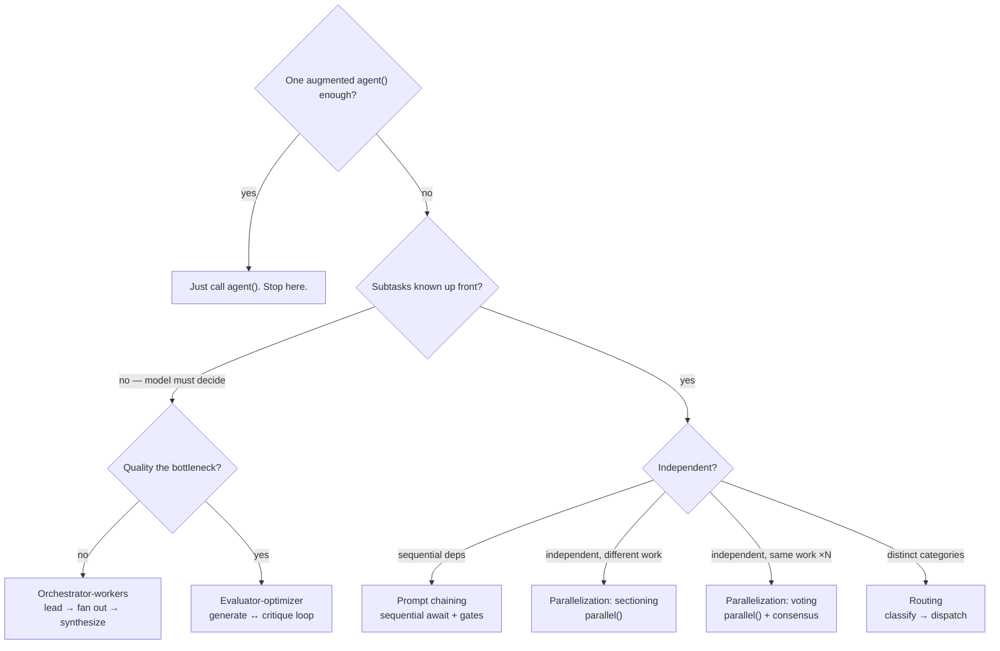

---

### Master map: canonical pattern → SDK → also in the shipped workflows?

| Canonical pattern (S1/S3) | SDK primitive | Found in binary? |
|---------------------------|---------------|------------------|
| Prompt chaining | sequential `await` / 1-item `pipeline` | partial (Scope→Find→Verify is a chain of phases) |
| Routing | `switch`/map over `agent()` | no (no runtime branching in the two scripts) |
| Parallelization — sectioning | `parallel()` | Pattern A2 (finder fan-out across angles) |
| Parallelization — voting | `parallel()` + consensus | **Pattern A4** (3-vote adversarial quorum) |
| Orchestrator-workers | lead `agent` → `parallel`/`pipeline` | **Patterns A1+A2** (the whole backbone) |
| Evaluator-optimizer / reflection | `for`/`while` + judge `agent` | **Pattern A3** (independent verifier per candidate) |
| Map-reduce | `pipeline` (stream) / `parallel`+reduce | Pattern A5 (dedup-at-synthesis = the reduce) |
| Autonomous agent | `agent({ agentType, isolation })` | n/a (workers are scoped, not autonomous) |
| Scale effort to complexity | branch on `budget` / score | **Pattern A8** (`PARAMS[effort]` table) |
| Separate citation pass | final attribution `agent()` | yes (deep-research citation step) |
| Resumability / checkpoints | `resumeFromRunId` replay | engine-level (see internals doc Section 9) |

**Takeaway:** the shipped workflows are a focused composition — *orchestrator-workers + sectioning + voting + reflection + map-reduce-at-synthesis + effort-scaling*. The patterns the binary does **not** use (routing, evaluator-optimizer loops, autonomous-agent delegation) are still expressible in the SDK; they're just not what review/research happen to need.

---

## Takeaways for writing your own

1. **Scope agent first**, emit a typed work-list.
2. **`pipeline` find→verify** so verification streams; reserve `parallel` barriers for genuine cross-item reductions.
3. **One independent (adversarial) verifier per item**, structured verdict, evidence required.
4. **Vote when there's no ground truth**; require a quorum and treat abstentions as non-passing.
5. **Dedup only at synthesis.** Verify everything; collapse at the end.
6. **Add a gap-only sweep** at high effort; tell it to return empty rather than pad.
7. **Early-exit** on empty.
8. **Scale breadth with an effort table; scale depth with `effort`.** They are orthogonal knobs.
9. **Cap and rank** the output; compute expected agent count.
10. **Start with one `agent()` call.** Only add topology when that single call provably falls short.
11. **Name your stopping criteria** before writing any loop — quality gate, iteration limit, or budget cap.
12. **Token economics matter**: multi-agent ≈ 15× chat cost. Gate deliberately on `budget`.

---

## Sources

- [Anthropic — Building Effective Agents](https://www.anthropic.com/research/building-effective-agents) (S1)
- [Anthropic Engineering — How we built our multi-agent research system](https://www.anthropic.com/engineering/built-multi-agent-research-system) (S2)
- [HuggingFace — Design Patterns for Building Agentic Workflows](https://huggingface.co/blog/dcarpintero/design-patterns-for-building-agentic-workflows) (S3)
- [arXiv 2605.13850 — A Two-Dimensional Framework for AI Agent Design Patterns](https://arxiv.org/html/2605.13850v1) (S4)
