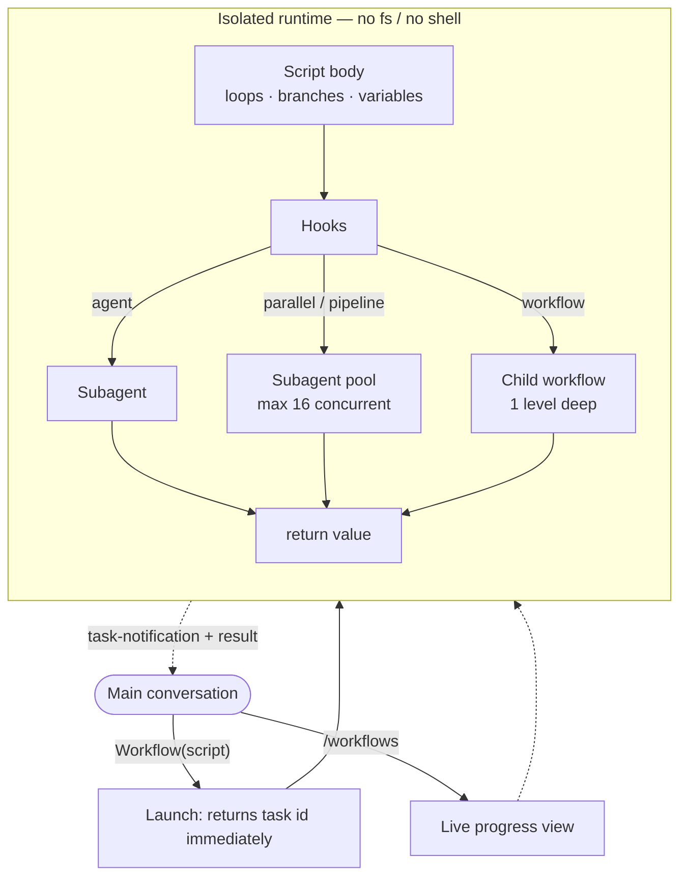
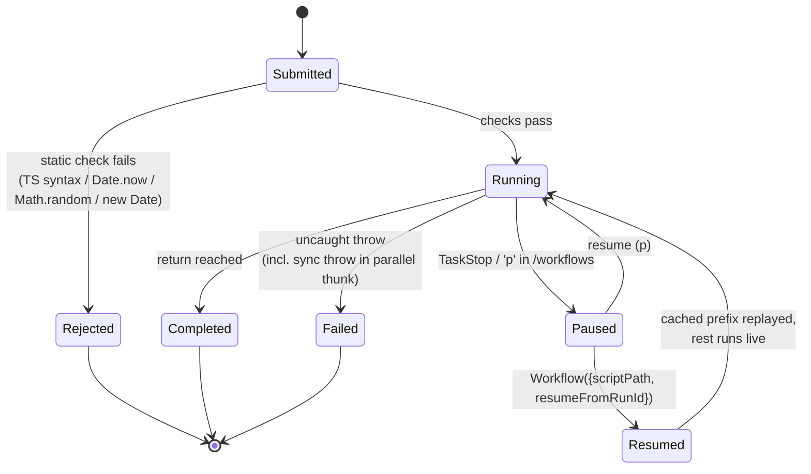
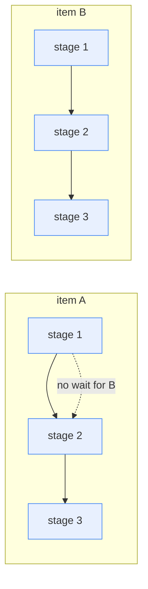
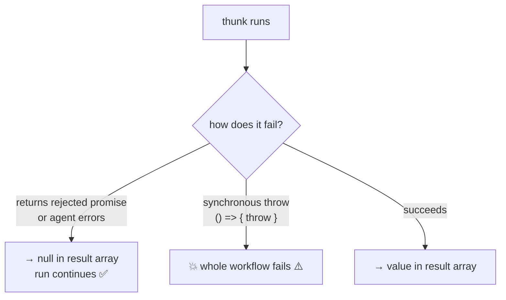
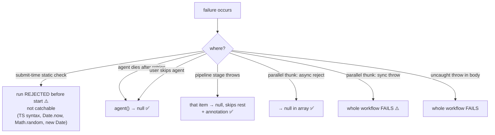
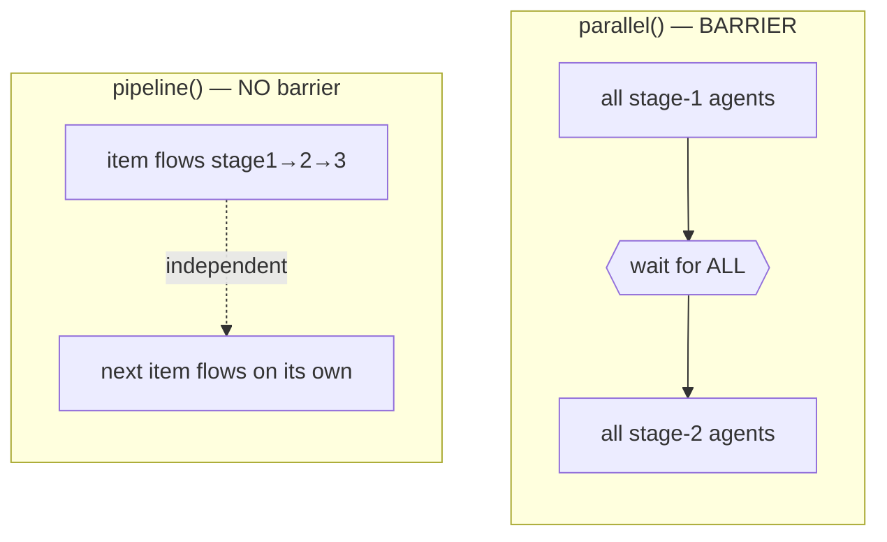
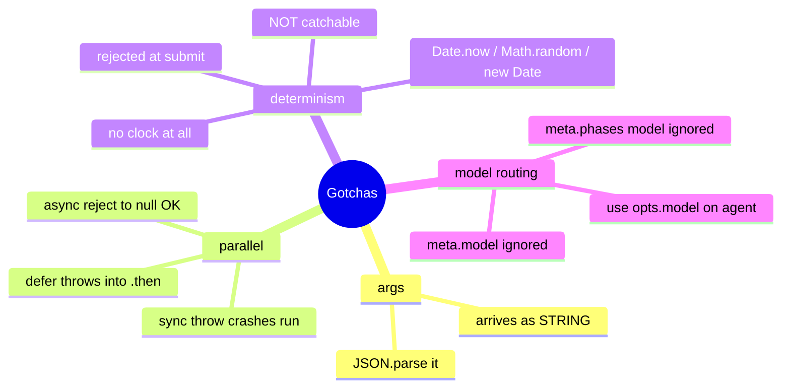

# Workflow Scripting API Reference

> Authoring reference for **dynamic workflow** scripts — JavaScript programs that orchestrate many subagents deterministically and run in the background.

- **Language:** plain JavaScript (ES2020+). **Not** TypeScript — type annotations, interfaces, generics fail to parse.
- **Context:** the script body runs inside an async function. `await` at top level is allowed.
- **Status tags:** every API entry carries a verification status from live testing in this environment:
  `✅ Verified` · `⚠️ Differs from spec` · `⬜ Untested`.

---

## Table of contents

1. [Execution model](#1-execution-model)
2. [Lifecycle](#2-lifecycle)
3. [`meta` declaration](#3-meta-declaration)
4. [Functions](#4-functions) — [`agent`](#agentprompt-opts) · [`pipeline`](#pipelineitems-stages) · [`parallel`](#parallelthunks) · [`phase`](#phasetitle) · [`log`](#logmessage) · [`workflow`](#workflownameorref-args)
5. [Globals](#5-globals) — [`args`](#args) · [`budget`](#budget)
6. [Error semantics](#6-error-semantics)
7. [`pipeline` vs `parallel`](#7-pipeline-vs-parallel)
8. [Determinism rules](#8-determinism-rules)
9. [Limits](#9-limits)
10. [Patterns](#10-patterns)
11. [Spec corrections](#11-spec-corrections)
12. [Verification ledger](#12-verification-ledger)

---

## 1. Execution model

A workflow is launched from the main conversation, then runs in an **isolated background runtime**. Intermediate results live in script variables, never in the conversation context — only the final `return` value is surfaced.



Key properties (all ✅):

| Property | Behavior |
|----------|----------|
| Launch | Non-blocking; returns a task id + run id + persisted script path. |
| Result delivery | A `<task-notification>` with the `return` value arrives on completion. |
| Script persistence | Each run writes its script to `~/.claude/projects/.../workflows/scripts/`. |
| Observability | `/workflows` shows phases, agent counts, token totals, elapsed time, live. |
| Isolation | The script cannot touch the filesystem or shell — only agents can. |

### Runtime environment (sandbox globals) — probed live

The script runs in a restricted VM. What's actually present:

| Available ✅ | Absent ❌ |
|--------------|-----------|
| `agent` `pipeline` `parallel` `phase` `log` `workflow` (hooks) | `fetch`, `require`, `process` (no network / Node / fs) |
| `budget` (object), `args` (`undefined` if not passed) | `setInterval`, `performance`, `crypto`, `structuredClone` |
| `JSON` `Math` (no `random`) `Promise` `globalThis` | `TextEncoder` `URL` `Buffer` `atob` |
| 🆕 `console` — `console.log` works | `Date` constructor / `Date.now` / `Math.random` (banned) |
| 🆕 `setTimeout` — real, fires callbacks (async delays OK) | `meta`, `runId` (not exposed as runtime globals) |

> **No in-script clock:** `Date` is banned *and* `performance` is absent, so the script cannot measure time. Get timestamps from `args` or stamp after return.
> `console.log` and `setTimeout` are undocumented but functional (verified: `setTimeout(fn,10)` set a flag; `console.log` did not throw).

---

## 2. Lifecycle



- **Rejected** happens *before* any agent runs — the error returns synchronously from the launch call. ⚠️ not catchable in-script.
- **Resume** requires the explicit `resumeFromRunId`; a plain re-run is a fresh run. ✅

---

## 3. `meta` declaration

✅ **Required.** Every script must begin with a pure-literal `export const meta`.

### Signature

```ts
export const meta: {
  name: string            // required — command/identifier
  description: string     // required — shown in the permission dialog
  whenToUse?: string      // shown in the workflow list
  phases?: Array<{ title: string; detail?: string; model?: string }>
  model?: string          // default model for the run
}
```

### Constraints

- Must be a **pure literal** — no variables, function calls, spreads, or template interpolation.
- `phases[].title` is matched **exactly** to `phase()` calls; a `phase()` with no match still gets its own group.

> ⚠️ **`model` fields in `meta` did NOT route agents in testing.** Both `meta.model` (run-level) and `meta.phases[].model` left the agent on the session model (`opus`), not the requested `haiku`. Only **`opts.model` on `agent()`** reliably changes the model. Treat the `meta` `model` fields as advisory/metadata until proven otherwise.

### Example

```js
export const meta = {
  name: 'review-changes',
  description: 'Review the diff across dimensions and verify each finding',
  whenToUse: 'Before merging a branch',
  phases: [
    { title: 'Review', detail: 'one agent per dimension' },
    { title: 'Verify', detail: 'adversarial check per finding', model: 'sonnet' },
  ],
}
```

---

## 4. Functions

### `agent(prompt, opts?)`

✅ Spawn a single subagent. The subagent's final text **is** its return value.

#### Signature

```ts
agent(prompt: string, opts?: {
  label?: string
  phase?: string
  schema?: object        // JSON Schema
  model?: string
  effort?: 'low' | 'medium' | 'high' | 'xhigh' | 'max'
  isolation?: 'worktree'
  agentType?: string
}): Promise<string | object | null>
```

#### Returns

- **`string`** — the agent's final text, when no `schema`. ✅
- **`object`** — a validated object, when `schema` is given (the agent is forced to emit structured output; retries on mismatch). ✅
- **`null`** — when the user skips the agent, or it dies on a terminal error after retries. Filter with `.filter(Boolean)`. ✅

#### Parameters

| Option | Type | Status | Notes |
|--------|------|--------|-------|
| `label` | string | ✅ | Display label in `/workflows`. Not in the return value. |
| `phase` | string | ✅ | Progress group. Set inside `pipeline`/`parallel` stages to avoid racing the global `phase()`. |
| `schema` | JSON Schema | ✅ | Forces a validated structured object as the return. |
| `model` | string | ✅ | Per-agent model. Confirmed: `'claude-haiku-4-5-20251001'` → agent self-reports haiku; omit → session model. |
| `effort` | enum | ✅ functional / ⚠️ unvalidated | Reasoning depth — drives internal **thinking time**, not output length (see controlled experiment below). Invalid value (`'banana'`) is **silently accepted**. |
| `isolation` | `'worktree'｜'remote'` | ✅ strict | `'worktree'` = fresh git worktree per agent; errors (`WorktreeIsolationError`) outside a git repo. 🔎 `'remote'` recognized but **gated off** — throws `agent({isolation:'remote'}) is not available in this build`. |
| `agentType` | string | ✅ strict | Custom subagent type (`'Explore'`, etc). Unknown type → **hard failure** listing available agents. Composes with `schema`. |
| `stallMs` | number | 🔎 source-only | **Undocumented** per-agent no-progress timeout (ms); default **180000**. Read by the scheduler in the binary; absent from the public type. |

> **Unknown opt keys are silently ignored.** Validation is per-opt: `agentType`/`isolation` strict, `effort`/unknown lenient.

#### `effort` — controlled experiment (output length held constant)

Same hard problem (count integers ≤1000 divisible by none of 2/3/5), answer forced to a single integer via `schema` so **output length is identical** across runs. Any duration gap is therefore internal thinking, not verbosity. 3 trials each:

| effort | durations (ms) | mean | output | tool_uses |
|--------|----------------|------|--------|-----------|
| `low` | 6097, 4471, 3240 | **4,603** | `266` (correct) | 1 |
| `max` | 11356, 20890, 23765 | **18,670** | `266` (correct) | 2 |

- **4× slower** at `max` with **identical output** → the extra time is reasoning, not longer text.
- **Zero overlap:** slowest `low` (6097) ≪ fastest `max` (11356).
- Output tokens nearly equal (`low` 18,084 / `max` ~19,500) because `subagent_tokens` counts visible output, not thinking — which is exactly why token count is a poor effort signal and **duration** is the right one.
- Conclusion: `effort` is wired and drives hidden reasoning time. (Both tiers solved this one; to see an *accuracy* gap, use a problem `low` fails.)

#### Throws

- Run fails if `agentType` is unknown.
- Run fails if `isolation:'worktree'` is requested outside a git repo (and no worktree hooks configured).

#### Example

```js
const text = await agent('Summarize the auth module.')
const bugs = await agent('List all bugs as JSON.', { schema: BUGS_SCHEMA, effort: 'high', label: 'find:bugs' })
const cheap = await agent('Classify this line.', { model: 'claude-haiku-4-5-20251001' })
```

---

### `pipeline(items, ...stages)`

✅ Run each item through all stages independently — **no barrier between stages**.

#### Signature

```ts
pipeline(
  items: any[],
  ...stages: Array<(prevResult: any, originalItem: any, index: number) => any>
): Promise<any[]>
```

#### Behavior

- Item A can be in stage 3 while item B is still in stage 1. Wall-clock = slowest single-item chain. ✅
- Every stage receives `(prevResult, originalItem, index)`. ✅ Confirmed.
- A stage that throws drops that item to `null`, skips its remaining stages, and emits a `<failures>` annotation. ✅ Confirmed.



#### Example

```js
const out = await pipeline(['x', 'y'],
  (item, orig, idx) => agent(`process ${item}`).then(r => ({ s1: r, idx })),
  (prev, orig, idx) => ({ ...prev, original: orig })
)
```

---

### `parallel(thunks)`

✅ Run thunks concurrently. **This is a BARRIER** — awaits all before returning.

#### Signature

```ts
parallel(thunks: Array<() => Promise<any>>): Promise<any[]>
```

#### Behavior

- An **async** failure (rejected promise / agent error) → `null` in the array; the call does not reject. ✅ Confirmed.
- ⚠️ A **synchronous** `throw` inside a thunk body **crashes the whole workflow** (status `failed`). NOT converted to `null`.



#### Example

```js
// safe — async failures degrade to null
const res = await parallel([
  () => agent('Say A.'),
  () => Promise.reject(new Error('x')),                       // → null
  () => agent('Say C.'),
])
res.filter(Boolean)                                           // ['A','C']

// fix a risky sync body by deferring into a promise
() => Promise.resolve().then(() => riskyThatMightThrow())     // throw → null, not crash
```

---

### `phase(title)`

✅ Start a progress group; subsequent `agent()` calls are grouped under `title` in `/workflows`.

```ts
phase(title: string): void
```

---

### `log(message)`

✅ Emit a narrator line above the progress tree. Does not affect the return value.

```ts
log(message: string): void
```

---

### `workflow(nameOrRef, args?)`

✅ Run another workflow inline as a sub-step; returns its return value.

#### Signature

```ts
workflow(nameOrRef: string | { scriptPath: string }, args?: any): Promise<any>
```

#### Behavior

- `string` → a saved workflow by name; `{scriptPath}` → a script file on disk. ✅ Confirmed via `{scriptPath}`.
- The child shares the run's concurrency cap, agent counter, abort signal, and token budget. ✅ Parent `agent_count` includes child agents.
- `args` becomes the child's `args` global (subject to stringification — see [`args`](#args)).
- **One level only** — `workflow()` inside a child throws. ✅ Confirmed: the inner call threw `workflow() cannot be called from within a child workflow — nesting is limited to one level.` The throw is **catchable inside the child** (the parent saw no error).
- Throws on unknown name / unreadable path. ✅ Confirmed and **catchable** with `try/catch`:
  - unknown name → `no workflow with that name. Available: deep-research, code-review`
  - bad path → `Workflow script file not found: <path>`

> Saved/named workflows discovered in this environment: **`deep-research`**, **`code-review`**.

```js
const sub = await workflow({ scriptPath: '/abs/path/child.js' })
try { await workflow('maybe-missing') } catch (e) { /* catchable, run continues */ }
```

---

## 5. Globals

### `args`

⚠️ **Arrives as a STRING.** The value passed to Workflow's `args` input — but even a JSON array/object is delivered as a string in this harness.

```ts
declare const args: string | undefined   // observed; nominally `any`
```

Observed: `typeof args === 'string'`, `Array.isArray(args) === false`. **Always parse defensively:**

```js
const input = typeof args === 'string' ? JSON.parse(args) : args
// input.map(...) / input.field now work
```

If `args` is omitted, the global is `undefined`.

### `budget`

✅ The turn's token target from a `+500k`-style directive.

```ts
declare const budget: {
  total: number | null    // null when no target set
  spent(): number         // output tokens this turn, shared across main loop + all workflows
  remaining(): number     // max(0, total - spent()), or Infinity when no target
}
```

| Member | Verified |
|--------|----------|
| `budget.total` | ✅ `null` when unset |
| `budget.spent()` | ✅ live number (shared pool, reflects prior spend) |
| `budget.remaining()` | ✅ `=== Infinity` when unset |

```js
while (budget.total && budget.remaining() > 50_000) { /* scale work to budget */ }
const FLEET = budget.total ? Math.floor(budget.total / 100_000) : 5
```

> `Infinity` is not JSON-serializable — don't `return` `remaining()` raw (it becomes `null`); return a boolean or `typeof`.

---

## 6. Error semantics



Survival rule: wrap risky synchronous work in `Promise.resolve().then(...)` so a throw becomes a catchable rejection (→ `null`) instead of a crash.

### Catchable vs fatal — verified

| Failure | `try/catch` works? | Effect |
|---------|:------------------:|--------|
| `workflow()` unknown name / bad path | ✅ yes | rejects the promise; run continues |
| `workflow()` nested too deep | ✅ yes | rejects inside the child; run continues |
| `parallel`/`pipeline` array > 4096 | ✅ yes | rejects the call; run continues |
| `parallel` thunk **async** reject / agent error | n/a | → `null` in array; run continues |
| `agent()` unknown `agentType` | ❌ no | **fatal** — whole run `failed` |
| `agent()` `isolation:'worktree'` outside git | ❌ no | **fatal** — whole run `failed` |
| `parallel` thunk **synchronous** throw | ❌ no | **fatal** — whole run `failed` |
| banned API (`Date.now`/`Math.random`/`new Date`) | ❌ no | **rejected at submit** — never starts |

> Rule of thumb: `workflow()` and the item-cap guards reject *gracefully* (catchable); bad `agent()` config and synchronous throws are *fatal*.

---

## 7. `pipeline` vs `parallel`

**Default to `pipeline()`.** Use a `parallel()` barrier between stages only when stage N needs cross-item context from all of stage N-1.



| Use a barrier when | Do NOT barrier for |
|--------------------|--------------------|
| Dedup/merge across the full result set | "I need to flatten/map/filter first" → do it inside a stage |
| Early-exit on zero total | "stages are conceptually separate" → that's just pipeline |
| Stage N references "the other findings" | "cleaner code" → barrier latency is real |

---

## 8. Determinism rules

⚠️ The runtime **statically rejects** non-deterministic calls at submit time (to keep resume caching valid). The error is returned from the launch call and **cannot** be caught in-script.

| Banned token | Use instead |
|--------------|-------------|
| `Date.now()` | stamp results after the workflow returns, or pass a timestamp via `args` (then `JSON.parse`) |
| `new Date()` | same; even argument forms trip the token scan |
| `Math.random()` | vary by `index` in `pipeline`/`parallel` instead |

Also banned: TypeScript syntax, filesystem access, Node APIs.

> Not banned (verified present): `console.log` and `setTimeout` both work. `setTimeout` is allowed despite the determinism stance — but avoid relying on wall-clock ordering, and never reach for `Date`/`performance` (absent) to time things.

---

## 9. Limits

| Limit | Value | Status |
|-------|-------|--------|
| Items per `parallel` / `pipeline` call | 4096 | ✅ Verified — 4097 → `Error: array length 4097 exceeds the maximum of 4096 supported across the workflow VM boundary`. **Catchable** with `try/catch`. |
| `workflow()` nesting depth | 1 | ✅ Verified — inner call throws, catchable in the child. |
| Concurrent agents per workflow | `Math.min(16, Math.max(2, cpuCores - 2))` | 🔎 Source — note the **floor of 2** (1–4 core box still gets ≥2) |
| Total agents per run | 1000 | 🔎 Source (`qol=1000`); cap message guides guarding `budget.total` loops |
| Per-agent stall timeout | 180000 ms | 🔎 Source (`stallMs` opt default) |
| VM synchronous-slice timeout | 30000 ms | 🔎 Source — only bounds sync code between awaits |

### Resume — ✅ Verified

Relaunch a completed/paused run with `Workflow({ scriptPath, resumeFromRunId })`. Cached `agent()` results replay instantly.

Proven: resuming the color/fruit demo returned the **identical** result with `subagent_tokens: 0` and `duration 15ms` (vs 7194ms / ~72k tokens on the original run) — agents replayed from cache, zero re-execution. A plain re-run **without** `resumeFromRunId` is a fresh run (all agents re-execute).

---

## 10. Patterns

> 🔎 **Two pattern catalogs ship with this doc:**
> - `CLAUDE_WORKFLOW_PATTERNS.md` — **reverse-engineered from the bundled production workflows** (`code-review`, `deep-research`).
> - `CLAUDE_WORKFLOW_PATTERNS_EXTERNAL.md` — **canonical/published patterns** (Anthropic *Building Effective Agents* + multi-agent research system + agentic-workflow literature), each mapped to the SDK primitives and cross-linked to the binary patterns.
>
> Backbone of the shipped workflows: **Scope → fan-out Find → stream Verify → Synthesize**. Load-bearing rules:
> - **`pipeline` find→verify, no barrier** — verify each finder's candidates as soon as it returns.
> - **One independent adversarial verifier per item** (verdict ladder `CONFIRMED/PLAUSIBLE/REFUTED`); for ground-truth-free claims, an **N-vote quorum** (`deep-research`: 3 votes, ≥2 refutations kill it; abstentions don't pass).
> - **Dedup only at synthesis**, never before verify.
> - **Gap-only sweep** at high effort ("return empty rather than pad"); **early-exit** when nothing survives.
> - **Two orthogonal knobs:** an effort→`{angles, perAngle, maxFindings, sweep}` table scales **breadth**; `opts.effort` scales **depth**. `max` vs `xhigh` changes reasoning depth, *not* fan-out.

### Canonical multi-stage (verify-as-you-go)

```js
const results = await pipeline(DIMENSIONS,
  d => agent(d.prompt, { phase: 'Review', schema: FINDINGS_SCHEMA }),
  review => parallel(review.findings.map(f => () =>
    agent(`Adversarially verify: ${f.title}`, { phase: 'Verify', schema: VERDICT_SCHEMA })
      .then(v => ({ ...f, verdict: v }))))
)
return { confirmed: results.flat().filter(Boolean).filter(f => f.verdict?.isReal) }
```

### Barrier when dedup needs all findings

```js
const all = await parallel(DIMENSIONS.map(d => () => agent(d.prompt, { schema: FINDINGS_SCHEMA })))
const deduped = dedupeByFileAndLine(all.filter(Boolean).flatMap(r => r.findings))
const verified = await parallel(deduped.map(f => () => agent(verifyPrompt(f), { schema: VERDICT_SCHEMA })))
```

### Loop-until-budget

```js
const bugs = []
while (budget.total && budget.remaining() > 50_000) {
  bugs.push(...(await agent('Find bugs.', { schema: BUGS_SCHEMA })).bugs)
  log(`${bugs.length} found, ${Math.round(budget.remaining() / 1000)}k left`)
}
```

### Catalogue

| Pattern | Purpose |
|---------|---------|
| Adversarial verify | N skeptics per finding, prompted to refute; kill on majority |
| Perspective-diverse verify | distinct lens per verifier (correctness/security/perf/repro) |
| Judge panel | N angled attempts → parallel judges → synthesize winner |
| Loop-until-dry | spawn finders until K empty rounds |
| Multi-modal sweep | parallel agents each searching a different way |
| Completeness critic | final "what's missing?" agent feeds the next round |
| No silent caps | `log()` whatever coverage was dropped |

---

## 11. Spec corrections

Three behaviors differ from the nominal spec — design around these:



| # | Spec says | Reality |
|---|-----------|---------|
| 1 | `args` is real JSON | string; must `JSON.parse` |
| 2 | parallel thunk throw → null | only async; sync throw crashes the run |
| 3 | banned APIs throw at runtime | rejected statically at submit, uncatchable |
| 4 | `meta` `model` / `phases[].model` overrides the model | no observable effect; only `opts.model` on `agent()` routes the model |

---

## 12. Verification ledger

| Feature | Status | Evidence |
|---------|--------|----------|
| `meta`, `phase`, `log`, `return` | ✅ | runs completed; return surfaced in `<result>` |
| `agent()` string / `schema` | ✅ | strings + validated objects returned |
| `opts.effort` | ✅ / ⚠️ unvalidated | low 13.6s vs max 25.9s, no overlap; `'banana'` accepted |
| `opts.model` | ✅ | haiku vs opus self-id; token drop |
| `opts.agentType` | ✅ strict | `Explore` ran; bad type → hard error |
| `opts.isolation:'worktree'` | ✅ strict | `WorktreeIsolationError` on non-git |
| `opts.label` / `opts.phase` | ✅ | accepted, display-only |
| unknown opt keys | ✅ ignored | `bogusOption` → no error |
| `pipeline` stage args + no-barrier | ✅ | stage 2 saw `(prev, orig, idx)` |
| `pipeline` stage-throw → null | ✅ | item null + `<failures>` |
| `parallel` async fail → null | ✅ | `Promise.reject` → null, continued |
| `parallel` sync throw | ⚠️ crash | status `failed` |
| `workflow({scriptPath})` | ✅ | child ran; agents counted in parent |
| `workflow()` unknown name / bad path | ✅ catchable | distinct error strings; reveals saved `deep-research`, `code-review` |
| `workflow()` nesting depth 1 | ✅ catchable | inner call throws, caught in child |
| `agentType` + `schema` compose | ✅ | `Explore` + schema → `{n:7}` validated |
| `meta.model` (run-level) | ⚠️ no effect | agent stayed on session model, not haiku |
| `meta.phases[].model` | ⚠️ no effect | agent stayed on session model, not haiku |
| `args` | ⚠️ stringified | needs `JSON.parse` |
| `budget.*` | ✅ | null / live number / Infinity |
| banned `Date.now`/`Math.random`/`new Date` | ⚠️ static reject | refused at submit, uncatchable |
| item cap 4096 | ✅ catchable | 4097 → VM-boundary error |
| `parallel([])` empty | ✅ | → `[]` |
| `console.log` / `setTimeout` | ✅ present | undocumented; both functional |
| no in-script clock (`Date`+`performance` absent) | ✅ confirmed | cannot time inside script |
| resume via `resumeFromRunId` | ✅ | cache hit: 0 tokens, 15ms, identical result |
| concurrency cap / 1000-agent cap | ⬜ | not stress-tested |
| `budget` hard-ceiling throw | ⬜ | needs a set budget; not exercised |
| user-skip → `null` / schema retry-on-mismatch | ⬜ | need user interaction / forced mismatch |
